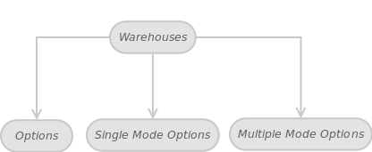
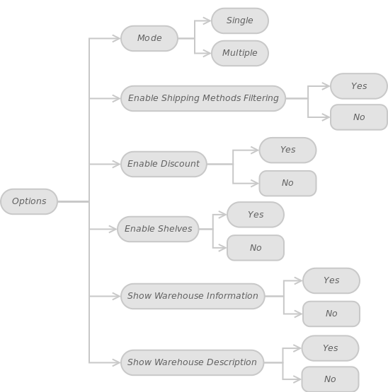
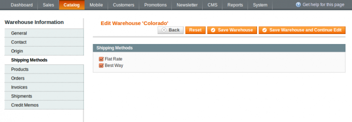
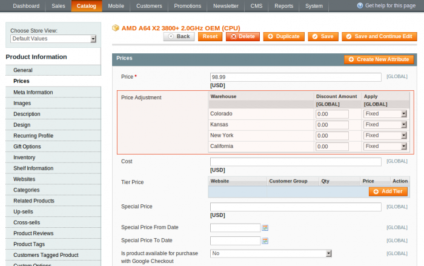
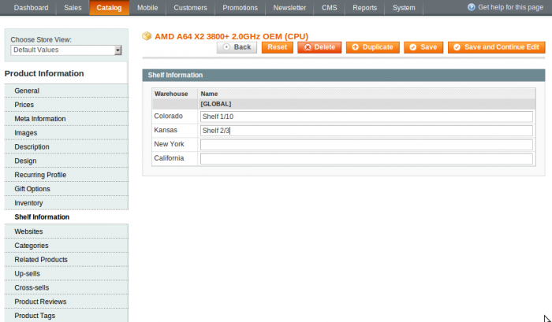

In this article, we’ll look at Multi-Warehouse extension options. Please follow this sequence of steps:

In administrator panel: System -> Configuration -> Catalog -> Warehouses. You’ll eventually see this:

This may also be represented in another form:

 

In turn, Options can be represented by the following diagram:

 
#### Mode

You can choose between two modes: Multiple and Single. Say, you have a web store configured with multiple warehouses. The shop administrator, selecting one of the two modes, can allow shipping either from multiple warehouses (Multiple) or from a single warehouse (Single), previously assigned to a customer. We’ll talk about it in the following article.

#### Enable Shipping Methods Filtering

As you know, there are different shipping methods such as: Flat rate, Table rate, FedEx, UPS, USPS, Canada Post, Royal Post, Free Shipping and so on. This option makes possible to filter available shipping methods for each warehouse individually. For instance, for a Canada warehouse you can apply Canada Post as only available shipping method. And Fedex, USPS, etc are US specific shipping methods. If set to Yes, the option is enabled. If the option is set to No then the filtering will be disabled. If option is enabled then Shipping Methods tab comes available for edit warehouse page.

#### Enable Discount

Any of your products can be listed in several warehouses. With this option, you will be able to offer discounts for the same product, depending on warehouse. Hence you will have a different product price for each warehouse. Yes – the option is enabled. No – the option is disabled. If the option is enabled then Price Adjustment field comes available for edit in product Prices tab.

 
#### Enable Shelves

You can store shelves information for each product using Shelf Information tab if the option is enabled.

#### Show Warehouse Information

A seller, at his discretion, may allow customers to see the warehouse information. Yes – enables to observe the warehouse data. No – disables to observe these data.

#### Show Warehouse Description

You can write some description (additional information) about your warehouses and share this information with customers. Select this option if you want your customer to view the description. Show Warehouse Information option must be enabled to take Show Warehouse Description enabled into effect.