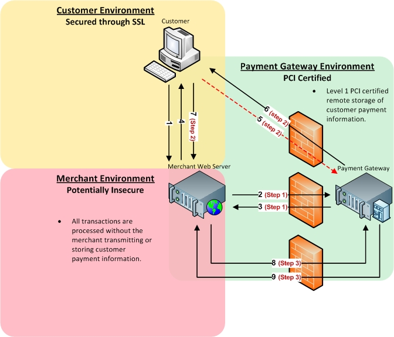

### Method Overview

1. Step One: Submit all transaction details to the Payment Gateway except the customer's sensitive payment information. The Payment Gateway will return a variable `form-url`.
1. Step Two: Create an HTML form that collects the customer's sensitive payment information and use the `form-url` that the Payment Gateway returns as the submit action in that form.
1. Step Three: Once the customer has been redirected, obtain the `token-id` and complete the transaction through an HTTPS POST including the `token-id` which abstracts the sensitive payment information that was collected directly by the Payment Gateway.

### Detailed Explanation

To start step one, your payment application will submit a behind-the-scenes HTTPS direct POST that includes transaction variables, including an additional variable `redirect-url`, which is a URL that must exist on your web server that handles a future browser redirect. Sensitive payment information such as `cc-number`, `cc-exp`, and `cvv` cannot be submitted during step one. The Payment Gateway will generate and return the form-url variable containing a unique URL to be used in Step 2.

Next, during step two, you must develop an HTML form that collects at least the customer's sensitive payment information such as `cc-number`, `cc-exp`, and `cvv`. You must use the `form-url` obtained in step one as the action in the HTML of your payment form. When the customer submits the form, the customer's browser will transparently POST the contents of the payment form directly to the Payment Gateway. This methodology keeps your web server and payment application from seeing or transmitting any credit card data or other sensitive data. Once the Payment Gateway has collected the customer's sensitive payment details, the customer's browser will be instructed to return to the `redirect-url` on your web server. Furthermore, the Payment Gateway will generate and append a unique variable named token-id to the `redirect-url` in the GET query string. This `token-id` is an abstraction of the customer's sensitive payment information that the Payment Gateway collected. Your `redirect-url` script must parse the `token-id` for use in step three.

To complete the transaction, you will submit another behind-the-scenes HTTPS direct POST including only the `token-id` and `api-key`. This `token-id` is used to "tie" together the initial customer information with the sensitive payment information that the payment gateway collected directly.

