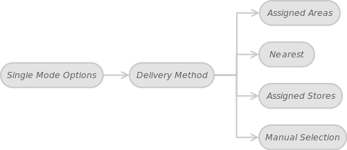

In the giving article, devoted to the Multi-Warehouse Magento extension, we will explore Single Mode Options.

In the previous article we also used for illustration the block diagram shown in Figure 1. Options Overview

The purpose of this paper is Single Mode Options. Let’s take a look at the following schematic diagram.

 

In the Configuration article we mentioned that a customer may be assigned to a particular warehouse. You can configure this option depending on delivery method: Assigned Areas, Nearest, Assigned Stores, Manual Selection.

Let’s represent initial data in tabular form:

 
Customer |	City |	State |	Zip / Postal Code |	Country
----- | ----- | ----- | ----- | ----- | 
John Doe |	Colby |	Kansas |	67701 |	United States

**Table 1 Customer Data**

 
Warehouse |	City |	State |	Zip / Postal Code |	Country
----- | ----- | ----- | ----- | ----- | 
Colorado |	Denver |	Colorado |	80202 |	United States
Kansas |	Kansas City |	Kansas |	66117 |	United States
New York |	New York |	New York |	10118 |	United States
California |	Sacramento |	California |	95866 |	United States

**Table 2 Warehouse Data**

 
#### Assigned Areas

If this option is enabled then Areas tab comes visible for a warehouse editor. You assign a customer to a warehouse by area (region, state, etc). In this case that will be the Kansas, since this warehouse is located in the customer’s state. The system tracks the customer’s location using Customer Locator feature.

#### Nearest

Use this option to assign a customer to the closest warehouse. In this case the system automatically chooses the Colorado that is nearest to John Doe’s location.

#### Assigned Stores

As you know, each website is a collection of store views that share the same customer and order information as well as shopping cart. This option may be useful if you have multiple store views in your web site and want to map store views to warehouses. Stores tab is available for a warehouse editor if this method is active. This way a customer will be assigned to a warehouse according to the current store view.

#### Manual Selection

This method permits a customer to choose an appropriate warehouse manually. If this option is enabled then Your Warehouse box comes visible for a customer.

