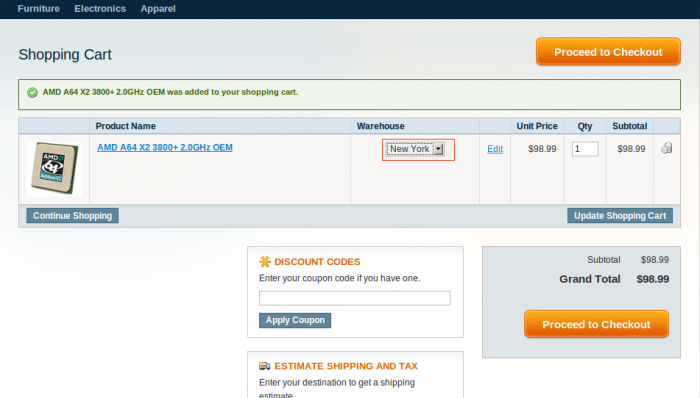

In previous articles we have considered: Main Options and Single Mode Options of the Multi-Warehouse Magento module. This article deals with Multiple Mode Options.

 

Figure 1. Options Overview shows a schematic illustration of the Multi-Warehouse options

 

In turn,

 

For convenience, this article will be split into two parts. The first part is dedicated to Delivery Method.

Initial data:

The customer John Doe from Colby (Kansas) wants to buy two products: Item A and Item B. You have two warehouses, one is Colorado and another one is Kansas.

#### Lowest Shipping

The system checks the items shipping prices for each warehouses combination and suggests the customer the products from the warehouses combination with the lowest shipping price. Lets assume each product shipping price is static for each warehouse and doesn’t vary depending on warehouses combination for products.

 
Warehouse |	Item A |	Item B
----- | ----- | -----
Colorado |	$1.00 |	$1.00
Kansas |	$1.50 |	$1.50

**Table 3. Lowest Shipping – Shipping Prices**

 
 	| Item B: $1.00 (Colorado)	| Item B: $1.50 (Kansas)
----- | ----- | -----
Item A: $1.00 (Colorado) |	$1.00 + $1.00 = $2.00 |	$1.00 + $1.50 = $2.50
Item A: $1.50 (Kansas) |	$1.50 + $1.00 = $2.50 |	$1.50 + $1.50 = $3.00

**Table 4. Lowest Shipping – Summary Shipping Prices**

 

In this instance, John Doe will get Item A and Item B in at the prices of the Colorado warehouse. If, for example, the Item B shipping price in the Kansas were $0.50, the system would suggest the Item A from the Colorado and the Item B from the Kansas.

#### Lowest Tax

If you select this delivery method option, Multi-Warehouse will set warehouses on the lowest tax basis.

 
Warehouse |	Item A |	Item B
----- | ----- | -----
Colorado |	$2.00 |	$2.00
Kansas |	$1.00 |	$1.00

**Table 5. Lowest Tax – Taxes**

 
 	| Item B: $2.00 (Colorado)	| Item B: $1.00 (Kansas)
----- | ----- | -----
Item A: $2.00 (Colorado) |	$2.00 + $2.00 = $4.00 |	$2.00 + $1.00 = $3.00
Item A: $1.00 (Kansas) |	$1.00 + $2.00 = $3.00 |	$1.00 + $1.00 = $2.00

**Table 6. Lowest Tax – Summary Taxes**

In this case, the order will be shipped from the Kansas.

##### Lowest Subtotal

You may sell the same product at different prices depending on the warehouse location. In the instance below you offer discounts on the Item A and the Item B for the warehouses Colorado and Kansas.

 
Warehouse |	Item A |	Item B
Colorado |Price:	$10.00 Discount:	$0.00 Final Price:	$10.00 | Price:	$10.00 Discount:	$1.00 Final Price:	$9.00
Kansas | Price:	$10.00 Discount:	$1.00 Final Price:	$9.00 | Price:	$10.00 Discount:	$0.00 Final Price:	$10.00

**Table 7. Lowest Subtotal – Prices**

 
 	| Item B: $9.00 (Colorado)	| Item B: $10.00 (Kansas)
----- | ----- | -----
Item A: $10.00 (Colorado) |	$10.00 + $9.00 = $19.00 |	$10.00 + $10.00 = $20.00
Item A: $9.00 (Kansas) |	$9.00 + $9.00 = $18.00 |	$9.00 + $10.00 = $19.00

**Table 8. Lowest Subtotal – Summary Prices**

 

The Multi-Warehouse Magento extension will specify the lowest price on every item and suggest it to the consumer (John Doe).

In this case, the system will offer:

 - Shipping of the Item A from the Kansas (Final Price: $9.00)
 - Shipping of the Item B from the Colorado (Final Price: $9.00)

#### Lowest Grand Total

The system selects products from warehouses by the lowest cart price. There are a number of factors that impact the total (sale) price of a product. Amongst them: tax, shipping price and discount. Hence, each product has individual final price according to the warehouse which it is stored in.

 
Warehouse	 | Item A	| Item B
----- | ------ | -----
Colorado | Price	$10.00 Tax	$2.00 Discount	$0.00 Shipping	$1.00 Final Price	$13.00 |  Price	$10.00 Tax	$2.00 Discount	$1.00 Shipping	$1.00 Final Price	$12.00
Kansas | Price	$10.00 Tax	$1.00 Discount	$1.00 Shipping	$1.50 Final Price	$11.50 | Price	$10.00 Tax	$1.00 Discount	$0.00 Shipping	$1.50 Final Price	$12.50

**Table 9. Lowest Grand Total – Prices**

 

Multi-Warehouse by InnoExts calculates all the factors and suggests the optimal solution. In this example that’ll be the lowest cart price (sum price of items A and B).

 
 	| Item B: $12.00 (Colorado) |	Item B: $12.50 (Kansas)
----- | ----- | -----
Item A: $13.00 (Colorado) |	$13.00 + $12.00 = $25.00 |	$13.00 + $12.50 = $25.50
Item A: $11.50 (Kansas) |	$11.50 + $12.00 = $23.50 \	$11.50 + $12.50 = $24.00

**Table 10. Lowest Grand Total – Summary Prices**

 
As you can see in the Table 10, the lowest cart price is $23.50. Thus the item A will be offered from the Kansas and the item B – from the Colorado.

#### Priority

You have multiple warehouses. One of them may be the main (Colorado) and the rest are additional (Kansas, New York, California).

In administrator panel follow: Catalog -> Manage Warehouses.

The smallest number means the highest priority. In the screenshot above we can see the following warehouse priority:

1. Colorado
1. Kansas
1. New York
1. California

The Priority option lets you offer the customer (John Doe) the products (Item A and Item B) from the warehouses in order of their priorities, starting with the highest priority warehouse first. If one of the products is out of stock (Colorado), the system will offer this item from another warehouse (Kansas) according to priority and so on.

#### Manual Selection

You can give the possibility to your visitors to select a warehouse for each product individually.

