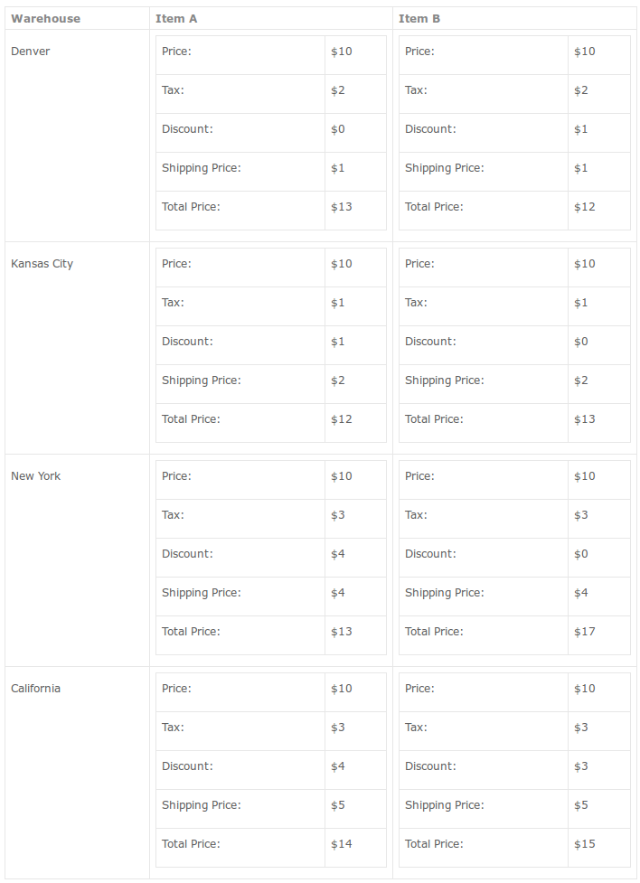
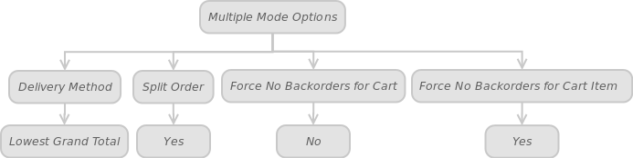
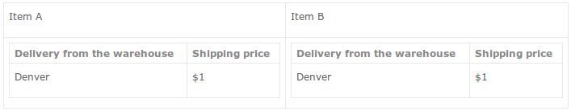

In the given article, we will explore some complex scenarios for Multiple Warehouse Mode Options.

Throughout this article, we’ll be referring to the initial data and tables.

Initial data:

We have a client, John Doe from Colby, Kansas who wishes to purchase products A and B in your webshop. In turn, you have four warehouses at your disposal: Denver, Kansas City, New York and California.

Let’s represent the initial data in tabular form:

Customer  | City |	State |	Item A quantity to buy	| Item B quantity to buy
----- | ----- | ----- | ----- | ----- 
John Doe | Colby | Kansas | 10 | 8

**Table 5.1. The customer data**

Warehouse |	City |	State |	Distance between the warehouse and the customer’s place of residence (Colby, Kansas)	 | Available quantity of the item A |	Available quantity of the item B |	Priority
----- | ----- | ----- | ----- | -----  | -----  | ----- 
Denver | Denver | Colorado | 234 Miles / 376 Km | 8 | 10 | 1
Kansas City | Kansas City | Kansas | 371 Miles / 597 Km | 8 | 6 | 2
New York | New York | New York | 1567 Miles / 2522 Km | 20 | 40 | 3
California | Sacramento | California | 1405 Miles / 2260 Km | 15 | 35 | 4

**Table 5.2. Warehouses**

**Table 5.3. Products prices**

Items | Item A: $13 (Denver) | Item A: $12 (Kansas City) | Item A: $13 (New York) | Item A: $14 (California)
----- | ----- | ----- | ----- | ----- 
Item B: $12 (Denver) | $13 + $12 = $25 | $12 + $12 = $24 | $13 + $12 = $25 | $14 + $12 = $26
Item B: $13 (Kansas City)	 | $13 + $13 = $26 | $12 + $13 = $25 | $13 + $13 = $26 | $14 + $13 = $27
Item B: $17 (New York)	 | $13 + $17 = $30 | $12 + $17 = $29 | $13 + $17 = $30 | $14 + $17 = $31
Item B: $15 (California) | $13 + $15 = $20 | $12 + $15 = $27 | $13 + $15 = $28 | $14 + $15 = $29

**Table 5.4. Cart price (Item A+ item B)**

Warehouse | Cart price
----- | -----
Denver | $13 + $12 = $25
Kansas City | $12 + $13 = $25
New York | $14 + $16 = $30
California | $13 + $16 = $29

**Table 5.5. Cart price if Force No Backorders for Cart is set to Yes**

#### Scenario 1

Result:
Lowest Grand Total (Lowest Cart Price) | Item A delivery from the warehouse | Item B from the warehouse
----- | ----- | ----- 
$24 | Kansas City | Denver

**Table 5.6. Results for the scenario 1**

Since "Force No Backorders for Cart" is set to No and Force No Backorders for Cart Item is set to No, the item A will be delivered from the Kansas City warehouse, despite the fact that the item A quantity at this depot (available quantity: 8) doesn’t satisfy the required conditions (required quantity: 10). The item B order will be fulfilled from the warehouse in Denver (available quantity: 10; required quantity 8).

#### Scenario 2

Result: 

Lowest Grand Total (Lowest Cart Price) | Item A delivery from the warehouse | Item B from the warehouse
----- | ----- | ----- 
$29 | California | California

**Table 5.7. Results for the scenario 2**

"Force No Backorders for Cart" implies that the order will be fulfilled from a single warehouse that has the required quantity of the items (A and B) in stock. In our case, the only two warehouses, California (item A quantity: 15, required quantity: 10; item B quantity: 35, required quantity: 8; cart price: $29) and New York (item A quantity: 20, required quantity: 10; item B quantity: 40, required quantity: 8; cart price: 30). If the Split Order is set to No, the Multi-Warehouse will generate a single order for both items.

Note: In Force No Backorders for Cart case, no matter if the Split Order is Yes or No, the system still won’t split the order.

#### Scenario 3

Result

Lowest Grand Total (Lowest Cart Price) | Item A delivery from the warehouse  | Item B from the warehouse
----- | ----- | ----- 
$25 | New York | Denver

**Table 5.8. Results for the scenario 3**

Lets suppose Force No Backorders for Cart Item is set to Yes. In this case, the system will offer the products (A and B) from multiple warehouses: the item A from the New York warehouse (the item A available quantity: 20; required quantity: 10) and the item B from Denver (the item B available quantity: 10, required quantity: 8). Therefore, the cart price is $25. That will be the optimal solution for scenario 3. If the Split Order is Yes, the order will be divided into two separate orders for each warehouse accordingly.

#### Scenario 4

Result:
Lowest Grand Total (Lowest Cart Price) | Item A delivery from the warehouse  | Item B from the warehouse
----- | ----- | ----- 
$29 | California | California

**Table 5.9. Results for the scenario 4**
 
Note: In this case, no matter if Force No Backorders for Cart Item is Yes or Force No Backorders for Cart Item is No, the order will still be delivered from a single warehouse.

Now let’s take a brief look at the following scenarios.

#### Scenario 5

 
Result:

 
#### Scenario 6

 
Result:

 
#### Scenario 7

 
Result:

 
#### Scenario 8

 
Result:

Item A delivery from the warehouse | Item B delivery from the warehouse
----- | ----- 
Denver | Denver

**Table 5.13. Results for the scenario 8**

 
#### Scenario 9

 
Result:

Item A delivery from the warehouse | Item B delivery from the warehouse
----- | ----- 
New York | New York

**Table 5.14. Results for the scenario 9**

 
##### Scenario 10

 
Result:

Item A delivery from the warehouse | Item B delivery from the warehouse
----- | ----- 
New York | Denver

**Table 5.15. Results for the scenario 10**

