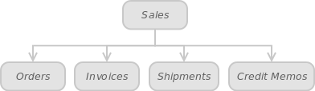

Admin panel: Sales

In turn,

 

Each of the tables shown in the Figure 8.1. has a Warehouse column that lets you filter your orders, invoices, shipments and credit memos by a particular warehouse. Sort this data by selecting a required warehouse from the dropdown list.
