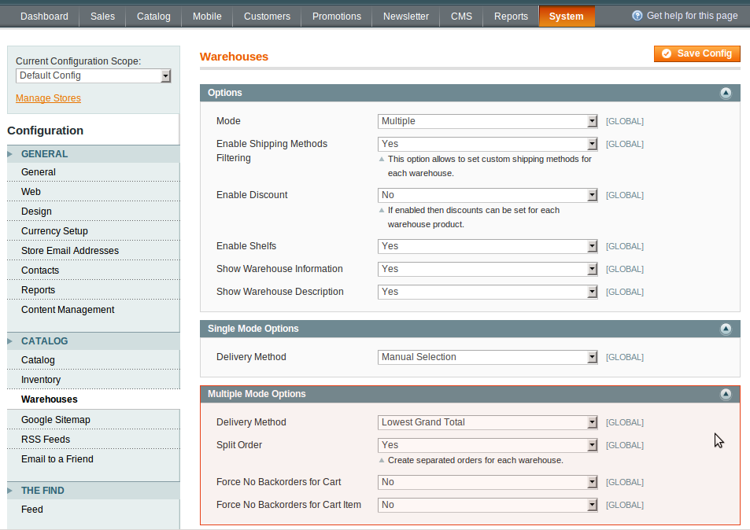
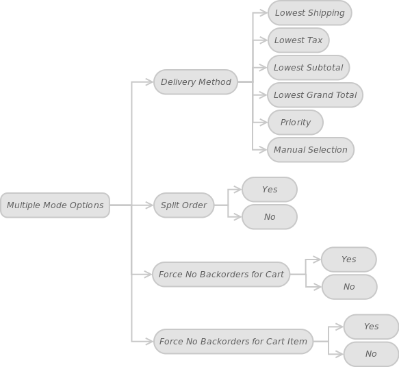

We continue our article talking about the Multiple Mode Options. In the first part of the article, we discussed the Delivery Method options. In the second part we'll consider the other options.

In administrator panel: System -> Configuration -> Catalog -> Warehouses -> Multiple Mode Options

We also displayed this in another form:

 

The customer John Doe wishes to buy two products item A and item B. The system assigns the customer to the Colorado warehouse by the Lowest Shipping delivery method. In turn, you have two warehouses: in  Kansas.

 
Warehouse |	Item A Status |	Item B Status
----- | ----- | -----
Colorado |	In-Stock |	Out-of-Stock
Kansas |	In-Stock | In-Stock

Table 11. – Product Statuses

 
#### Delivery Method

Read our previous article about this option.

#### Split Order

This option will allow you to divide an order into several orders per warehouse. Assume that a customer has two products in the shopping cart: item A in the Denver warehouse and item B in the Kansas City warehouse. If the option is enabled (Split Order equals to Yes), the system will generate two separate orders for each warehouse, the Item A order in Denver and the item B order in Kansas City. If the option is disabled (Split Order equals to No), the system will create a single (non-split) order for the products.

####  Force No Backorders for Cart

If you set Force No Backorders for Cart to Yes, the Multi-Warehouse doesn’t allow backordered products and in-stock items to be in the same shopping cart. Furthermore, the customer's order will filled only if all shopping cart items are available in the particular warehouse. If at least one item is unavailable in the warehouse, the system will select another accessible warehouse with products in stock. In the John Doe’s case (see initial data above), the system will allow you to order products A and B from the Kansas City warehouse only.

Force No Backorders for Cart is set to No. This option lets customers order both in-stock items and backordered items. In the example above, the system will fulfill the order from the Denver warehouse.

####  Force No Backorders for Cart Item

This option is similar to the previous one. The only difference is that it's applied with regards to a particular shopping cart item.

Force No Backorders for Cart Item is set to Yes. With this option you don’t allow specific products to be backordered. In the example above, the item A will be shipped to the customer from the warehouse in Denver, while the item B will be delivered from the Kansas City warehouse.

Force No Backorders for Cart Item is set to No. The system will allow customers to purchase a particular item, when it is out of stock. In this case, both the item A and B will be shipped from the Denver warehouse.
