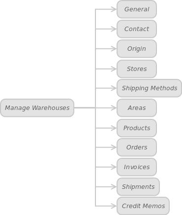

In administrator panel: Catalog -> Manage Warehouses

Once you have followed the steps above, you will receive the list of all your warehouses with some data about them, such as code, title, origin country, origin region / state, origin postal code, origin city.

Select the warehouse, you want to edit and click Edit link.

In these tabs you can edit a particular warehouse data.

It will look like this in your screen:

#### General

In this tab you can edit / add the title and the code of a warehouse. Also, you can describe the warehouse (create a description) and specify its priority.

 
#### Contact

This tab contains the following fields: Notify, Name, Email. The system will use this data to inform you about new orders. Enter your name and email and place a tick in the box Notify. Now you will always get an email notification every time a new order is placed. (Regarding the specific warehouse).

 
#### Origin

Information on the warehouse location (country, region / state, zip / postal code, city).

 
#### Stores

This tab appears when you set the following configuration options: Admin panel: System -> Configuration -> Catalog -> Warehouses -> Mode -> Single -> Delivery Method -> Assigned Stores -> Save Config.

The "Stores" option helps you to create a relationship between a warehouse and a website (store or store view).

 
#### Shipping Methods

This tab appears when you set the following configuration options: Admin panel: System -> Configuration -> Catalog -> Warehouses -> Enable Shipping Methods -> Yes -> Save Config. Now you can select certain shipping methods for each warehouse separately.

To add more delivery methods, follow this: Admin Panel: System -> Configuration -> Sales -> Shipping Methods -> Select a desired method -> Enabled for Checkout -> Yes -> Save Config.

 
#### Areas

This tab appears when you set the following configuration options: Admin panel: System -> Configuration -> Catalog -> Warehouses -> Mode -> Single -> Delivery Method -> Assigned Areas -> Save Config. Some of the information in this table is similar to that contained in the Origin table. The difference is that the system uses these data (Areas table data ) to assign a customer to the warehouse.

 
#### Products

The detailed list of the products, stocked in the specific warehouse. You can use this tab to edit the products details or add new products.

 
#### Orders

This table displays information about all orders placed at the particular warehouse. You can add new orders and edit/delete existing ones.

 
#### Invoices

The same, but with regards to invoices.

 
#### Shipments

The same, but with regards to shipment.

 
#### Credit Memos

The same, but with regards to credit memos.

To add a new warehouse, back to warehouses list, click Add Warehouse button, enter your new warehouse data and click Save.

Admin panel: Catalog -> Manage Warehouses -> Add Warehouse
