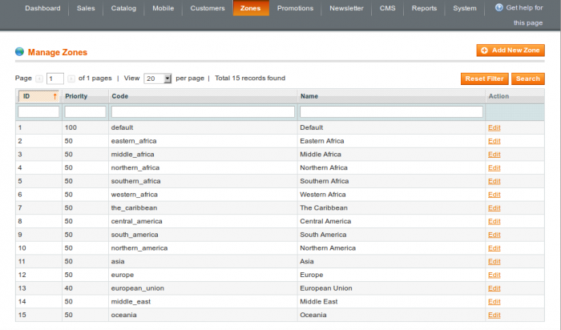
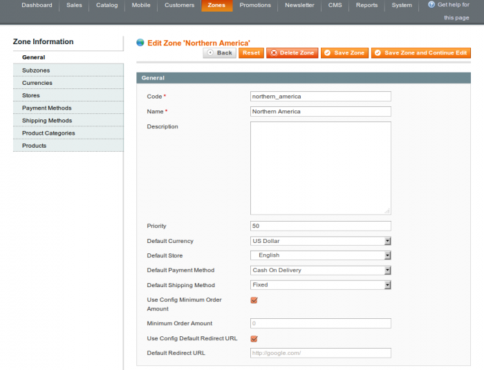
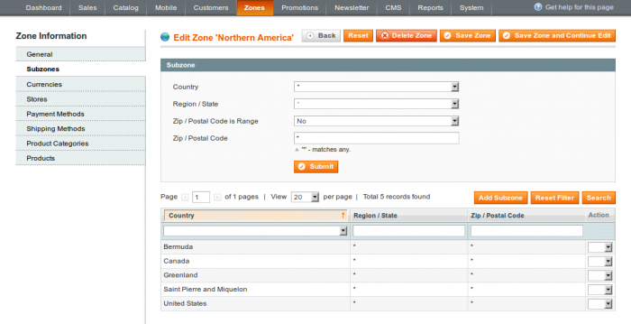
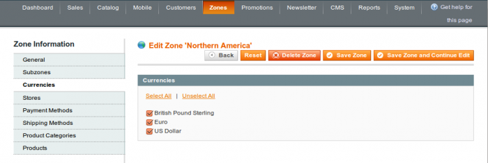
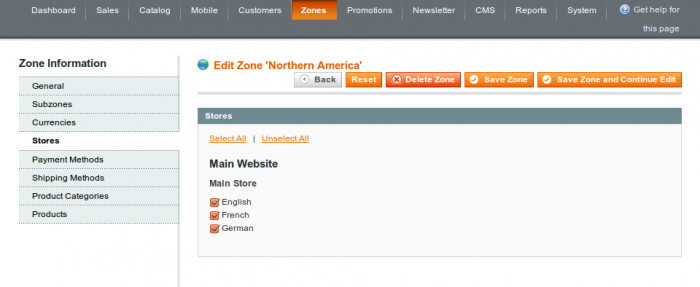
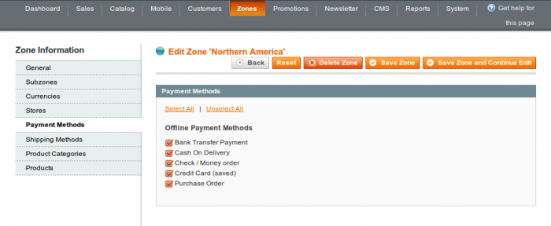
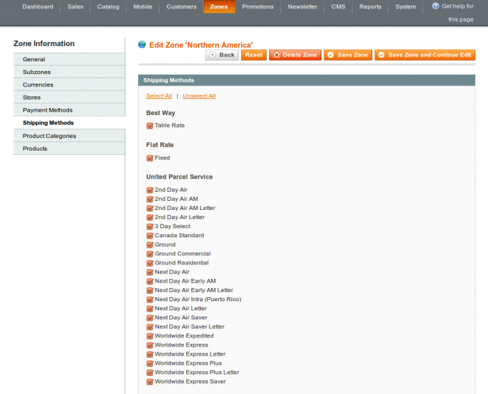
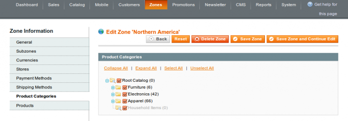
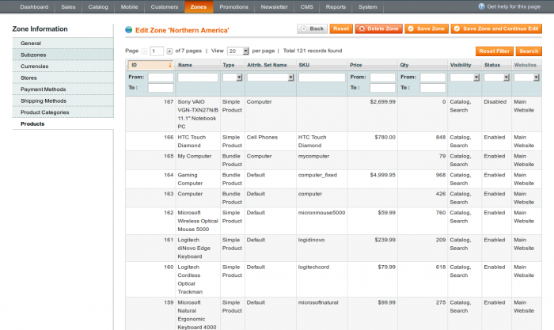

In administrator panel: Zones -> Manage Zones

Here you can create new customer zones by pressing the Add New Zone button or edit existing ones by clicking the Edit link. The Default zone is being created during the installation. This zone is coming applied in case if there are no other zones matching a visitor and it can’t be removed from the system.

 
### General

The only tab that is available for the create new zone process is General. Here you fill in zone general details

#### Code

Zone code is the unique human readable alternative to the identifier attribute.

#### Name

Zone display name.

#### Description

Zone description. This attribute is for the internal use for the administrator. Basically it was reserved for the future.

#### Priority

Zone priority in case if there are more than 1 zone matching a customer location (zones are intersecting). Zone with the lowest priority value comes assigned to the customer.

#### Default Currency

The currency that is coming selected automatically for a customer assigned to the zone. Default Currency must be selected in Currencies.

#### Default Store

The store which a customer is being redirected to initially. The value must be selected in Stores.

#### Default Payment Method

The payment method that is selected by default for the checkout process. The value must be selected in Payment Methods.

#### Default Shipping Method

The shipping method that is selected by default for the checkout and estimate shipping functions. The value must be selected in Shipping Methods.

#### Minimum Order Amount

The minimum order amount for the zone. Tick Use Config Minimum Order Amount checkbox if the value should be similar to that is set in the configuration globally or enter the custom one.

#### Default Redirect URL

The default redirection URL in case if a store isn’t allowed for a customer. Check Use Config Default Redirect URL to inherit the value that is set in the configuration globally.

### Subzones

Each zone can include a number of subzones in it for the flexibility. Each subzone can be defined as country, region, exact zip code or zip codes range.

Note, region select is available for the specific countries only with regions data installed initially.

### Currencies

Allowed currencies list for the zone. The store base currency is available independently of this attribute. The currency must be enabled in the configuration initially: System -> General -> Currency Setup -> Currency Options -> Allowed Currencies.

### Stores

Allowed stores list for the zone.

### Payment Methods

 

Allowed payment methods list for the zone. The payment method must be previously enabled in the Payment Methods configuration settings section: System -> Configuration -> Sales -> Payment Methods.

### Shipping Methods

 

Allowed shipping methods list for the zone. The shipping carrier must be previously enabled in the Shipping Methods configuration settings section: System -> Configuration -> Sales -> Shipping Methods.

### Product Categories

 

Administrator is able to overwrite available product categories list depending on zone here.

Note, product category availability doesn’t affect products availability itself.

### Products

 

The list of products enabled for the zone. The zone can be enabled for the specific product in products manager.