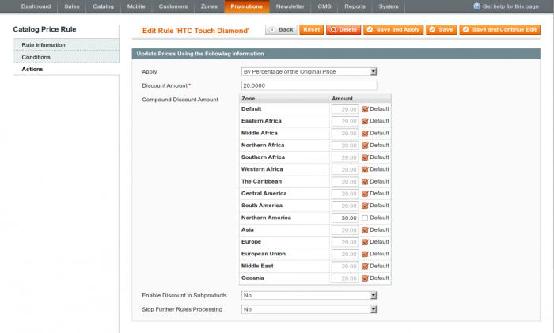
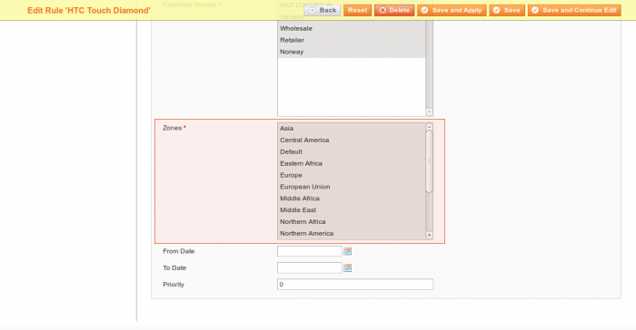

In administrator panel: Promotions -> Catalog Price Rules

The Zones Manager adds more flexibility to the catalog price rules function. It allows you to enable / disable the rule for specific zones and to set a discount amount for each zone independently. Click edit rule.

### Zones

 

The Zones attribute is placed under the Customer Groups on the Rule Information tab. It allows you to enable / disable the rule for the specific zones.

### Compound Discount Amount

Compound Discount Amount attribute is placed under the Discount Amount on the Actions tab. It allows you to overwrite the discount amount for each zone.
