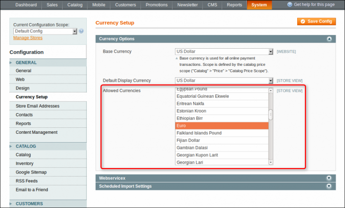
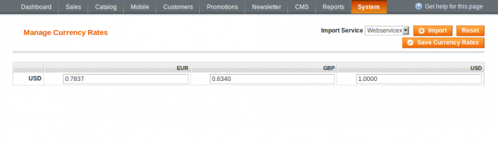
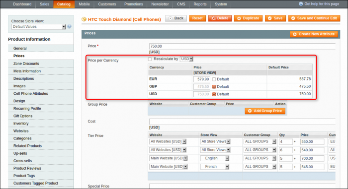
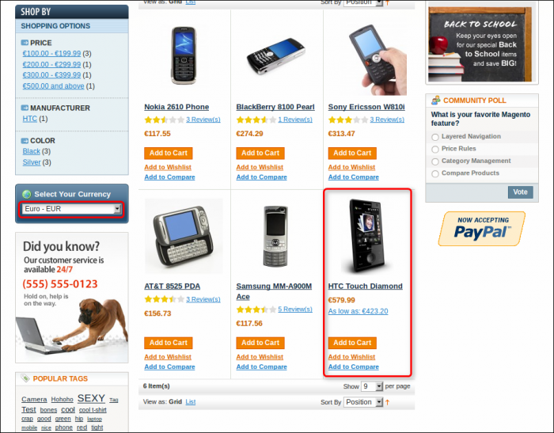
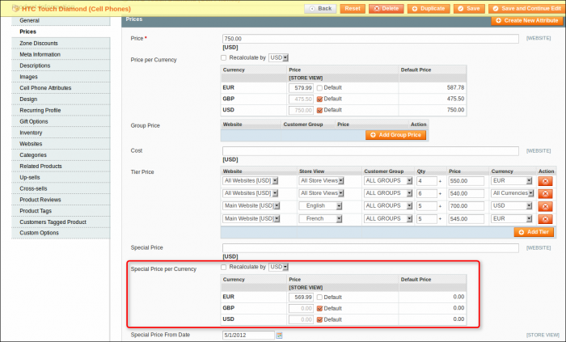
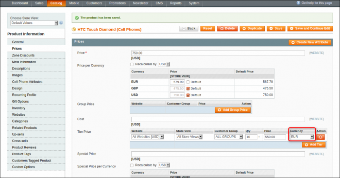
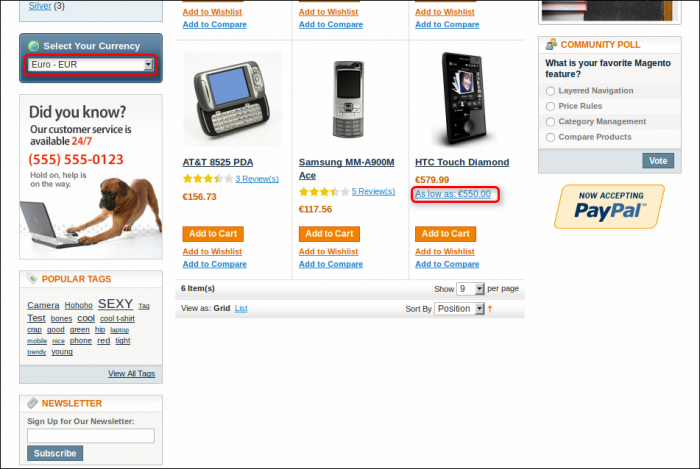
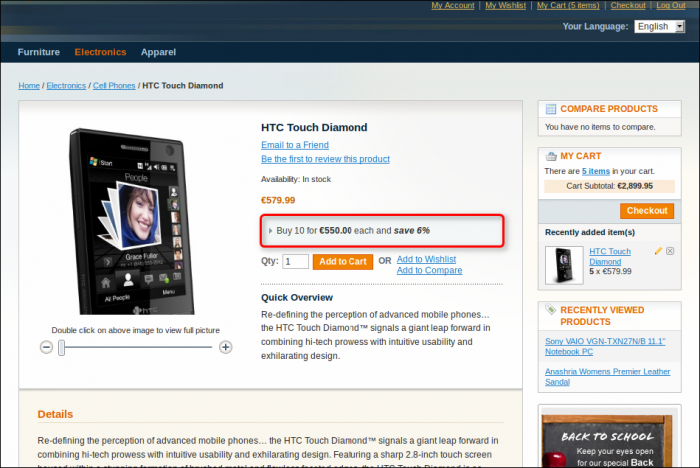

### Enable Currencies

We will describe how to add more currencies to the system here. Please note, this feature is a standard Magento Community Edition function.

In administrator panel: System -> Configuration -> General -> Currency Setup -> Allowed Currencies.

 

Choose as many currencies as you need. If you have a wide range of international consumers, you will need a list of all your customer's money units. Make the list of all required currencies.

In administrator panel: System -> Manage Currency Rates or System -> Manage Currency -> Rates (if your Magento version is equal or above 1.7.0).

 

Now you can set the currency rates that are beneficial (most appropriate) to you manually or by importing the rates from a service like Webservicex. Save results.

So, you can choose as many currencies as you want. But if your currency list is too long, you may limit it with the Currency Geo Filter extension. It will let your customer select currencies from the short list of monetary units which are common in their region.

### Price

You can overwrite the product price for each currency separately.

In administrator panel: Catalog -> Manage Products -> Edit Product -> Prices -> Price Per Currency.

 

Uncheck the appropriate Default check box if you need to overwrite any currency price. If the Default checkbox is marked then the currency price will be dynamically calculated according to currency rates (default behaviour of Magento). Recalculating by function may assist you in overwriting currency prices by the desired currency. Check Recalculate by checkbox and select the primary currency you want to use for recalculation. Once the primary currency is changed, other currency prices are updated depending on rates automatically.

Now when a customer comes to your store and selects currency, he will see this next:

 
### Special Price

You can overwrite the product's special price for each currency separately, similar to the price described above.

In administrator panel: Catalog -> Manage Products -> Edit Product -> Prices -> Special Price Per Currency.

 

On the frontend:

 
### Tier Price

Tier pricing can be applied either for each currency individually or for all currencies in the base monetary unit.

In administrator panel: Catalog -> Manage Products -> Edit Product -> Prices -> Tier Price.

 

On the frontend:

 

 
