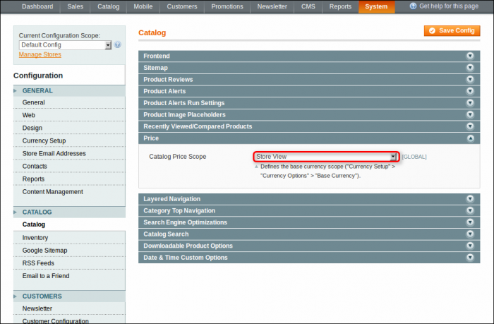
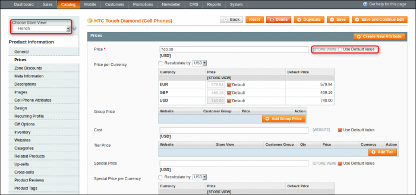
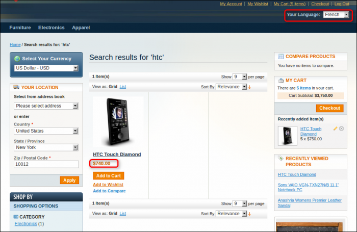
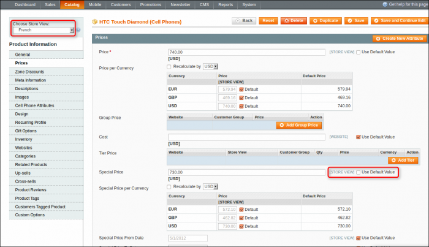
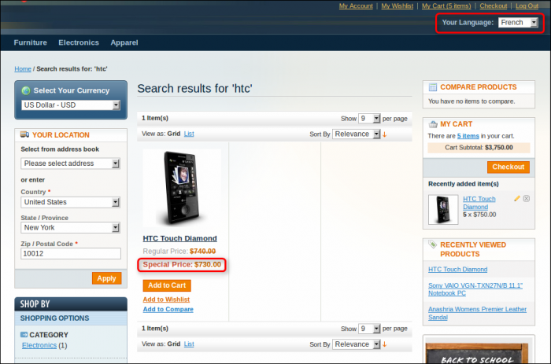
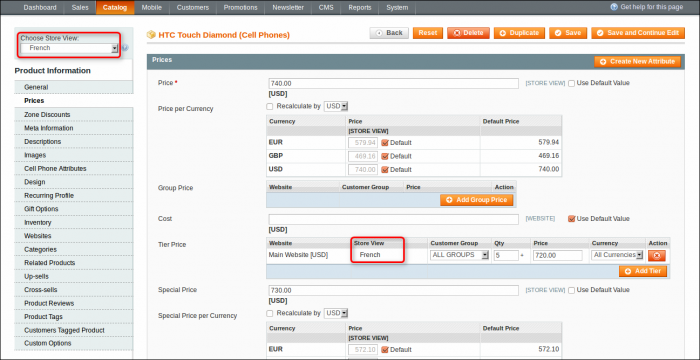
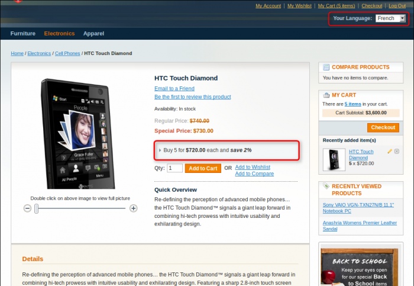

### Setting Price Scope

Advanced Pricing appends the Store View product price scope in addition to Global and Website.

In administrator panel: System -> Configuration -> Catalog -> Catalog -> Price -> Catalog Price Scope.

 

Select scope and save configuration. Once the price scope is changed, the system reindexes the Product Price data and resets the scope for the next product attributes: Price, Special Price, Special Price From Date, Special Price To Date, Tier Price

### Price

You can define the product price for each store view separately.

In administrator panel: Catalog -> Manage Products -> Edit Product -> Prices -> Price.

 

Select the store view with the store view selector. You can set the price here. Uncheck Use Default Value flag and enter the value. Besides the Price, you can set the Price per Currency for each currency and store view individually.

Now when a customer comes to your store and selects the store view, he will see this next:

### Special Price

The system makes it possible to overwrite the product's special price for each store view, similar to the price described above.

In administrator panel: Catalog -> Manage Products -> Edit Product -> Prices -> Special Price.

 

On the frontend, select the French store view:

### Tier Price

The Tier price can be applied for store view as well.

In administrator panel: Catalog -> Manage Products -> Edit Product -> Prices -> Tier Price.

 

On the frontend, select the French store view:

![Price Scope - Tier Price - Products](advanced-pricing-price-scope-tier-price-products-700x491.png} 

