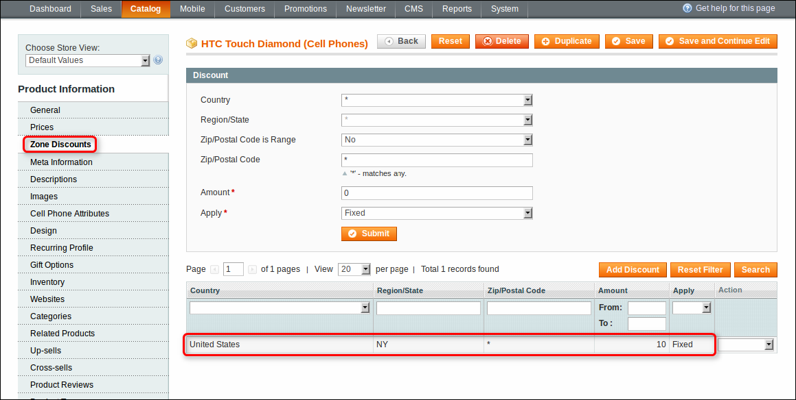
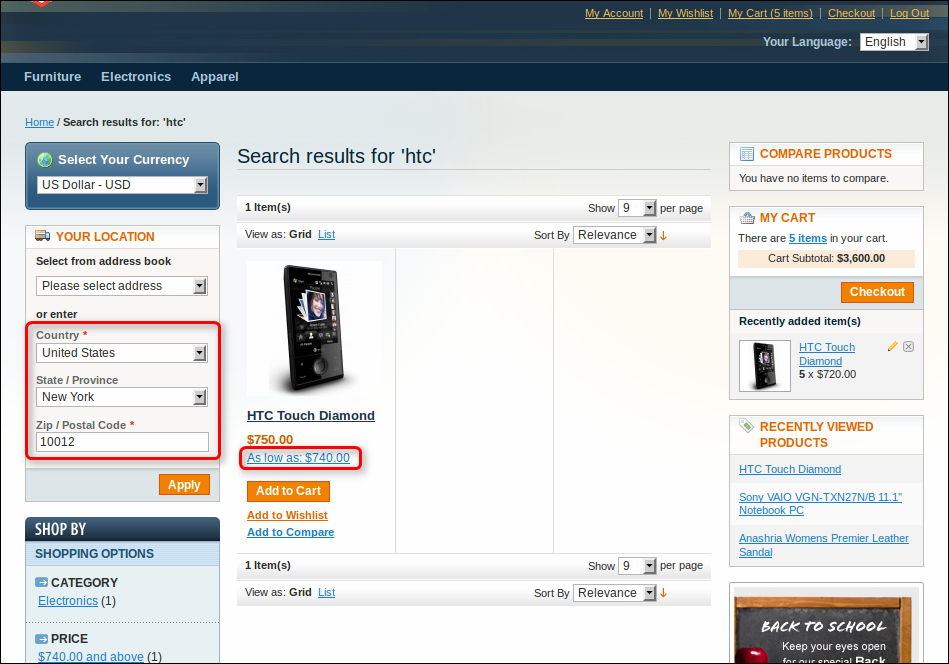
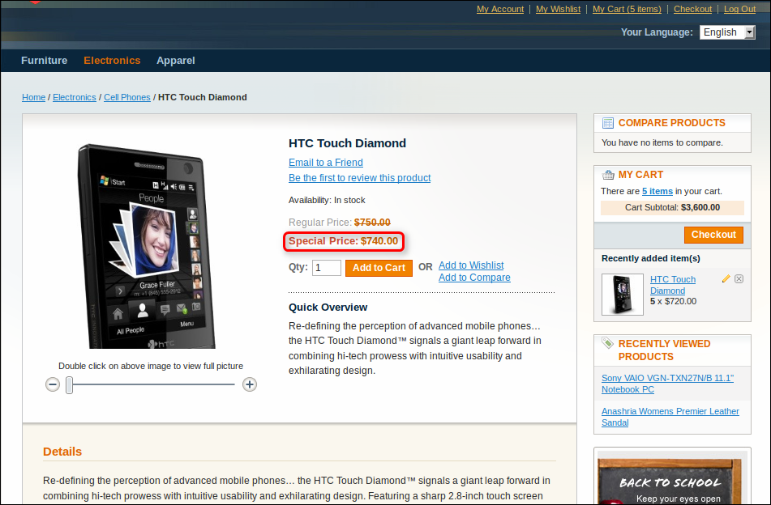

Advanced Pricing makes it possible to set discounts depending on the visitor's address.

In administrator panel: Catalog -> Manage Products -> Edit Product -> Zone Discounts.

 

You can manage discount zones here:

 - Country – Choose a particular country
 - Region/State – Choose a particular region / state
 - Zip/Postal Code is Range – Either zip / postal code is range or not
 - Zip/Postal Code From – Enter starting zip / postal code
 - Zip/Postal Code To – Enter ending zip / postal code
 - Zip/Postal Code – Enter zip / postal code
 - Amount – Enter discount value
 - Apply – Select percentage discount or fixed amount to deduct from the price

Don’t forget to save the product after you have finished with discount zones.

On the frontend:

 

 
