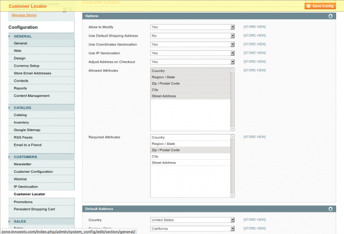
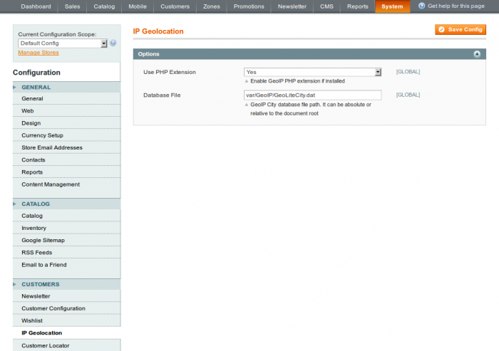

This supplementary tool allows you to detect visitors' location as soon as they come to the website. The location can be either the default shipping address, geolocated coordinates, geolocated IP address, default location or manualy entered by the visitor depending on needs.

## Configuration

In administrator panel: System > Configuration > Customers > Customer Locator

 

You can see the Options and Default Location sections there.

### Options

#### Allow to Modify

If the option is enabled then customer will be able to enter / correct his location manually on the frontend side.

#### Use Default Shipping Address

If the option is enabled, then the customer's default shipping address will be used as the current location. This option has the highest priority in the address determination process.

#### Coordinate Geolocation

If the option is enabled then customer becomes geolocated by coordinates through the Google Geocoder service. The client browser provides coordinates if it is allowed by the customer. Coordinates geolocation takes effect if the default shipping address isn’t set or disabled.

#### IP Geolocation

If the option is enabled, then the customer becomes geolocated via IP through the MaxMind GeoCity database. IP geolocation takes effect if the default shipping address isn’t set or disabled and coordinates geolocation is disbaled or failed.

#### Adjust Address on Checkout

This option allows the customer location to be updated if the actual checkout address is different.

#### Allowed Attributes

Address attributes list which customer is able to change manually.

#### Required Attributes

Required address attributes to be entered by a customer.

### Default Address

The default visitor’s location can be defined here. Country, Region / State, Zip / Postal Code, City can be entered. The system sets visitor’s location to default if no of other methods are allowed to determine the customer location.

## Manual Selection

 

This function allows customer to change his location manually.

## IP Geolocation

In administrator panel: System > Configuration > Customers > IP Geolocation

 

The IP Geolocator options are placed here: Use PHP Extension, Database File. This function is based on MaxMind GeoCity database. The PHP Extension option directs the system to use built-in geoip PHP extension in the first turn. If no geoip PHP extension is installed correctly with the GeoCity database or if the PHP Extension option is set to No, then the function relies on it's own database. The correct GeoCity database path must be entered in the Database File optio, if no geoip PHP extension is installed properly with the GeoCity database.

This supplementary tool allows you to detect the visitor’s location as soon as he comes to the website. The location can be either the default shipping address, geolocated IP address, default location or be manualy entered by the visitor.

In administrator panel: System > Configuration > Customers > Customer Locator

 

You can see the Options and Default Location sections there.

**Options**

 - Allow to Modify – If the option is enabled, then the customer will be able to enter / correct his location on the frontend.
 - Select the Default Shipping Address – If the option is enabled, then the customer's default shipping address will be used as the current location instead of the geolocated IP address geolocated (if default shipping address is present).
 - Allowed Attributes – Address attributes list to display in Your Location box.
 - Required Attributes – Required address attributes.

**Default Address**

The default visitor’s location can be defined here. Country, Region / State, Zip / Postal Code, City can be entered. The system sets visitor’s location to default if the IP address geolocation failed (it is possible for small percentage of visitors).

On the frontend:

 
