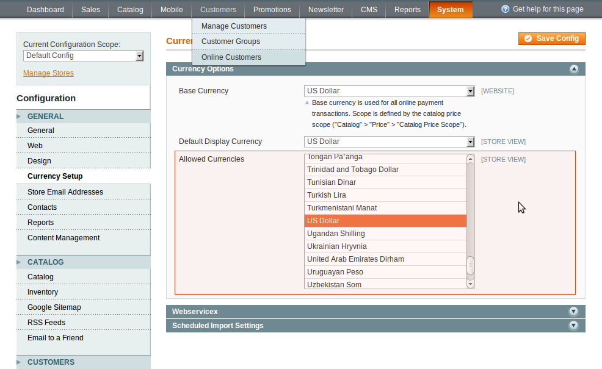

We will describe how to add more currencies to the system here. Please note, this feature is the standard Magento Community Edition function.

In administrator panel: System -> Configuration -> General -> Currency Setup -> Allowed Currency .

 

Choose as many currencies as you need. If you have a wide range of international consumers, you will need a list of all your customer's money units. Make the list of all required currencies.

In administrator panel: System -> Manage Currency Rates .

 

Now you can set the currency rates that are beneficial (most appropriate) to you manually or by importing the rates from a service like Webservicex. Save the results and regenerate the Product Prices index.

So, you can choose as many currencies as you want. But if your currency list is too long, you may want to limit it in order to let your customer select currencies from the short list of monetary units (which are common in their region). In addition, the system will automatically display the product's price in the visitor's native currency. For example you have a list of 20 currencies. A visitor from say, Germany doesn’t need to see prices in Japanese Yen and so on. Shorten this list by setting only two currencies (or more) for Germany: USD and EUR. Now when the German customer comes to your site, he will browse item's price in EUR or select US currency from the drop down list. You can perform such tasks by using the Currency Geo Filter extension. The Currency Geo Filter detects your visitor' geo-location by IP address, it automatically converts prices in the customer currencies and offers only the most spread monetary units of a given area.
