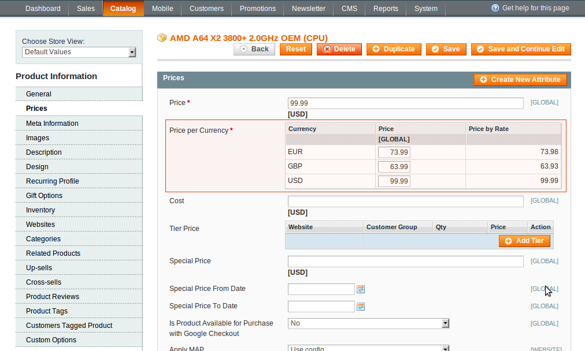
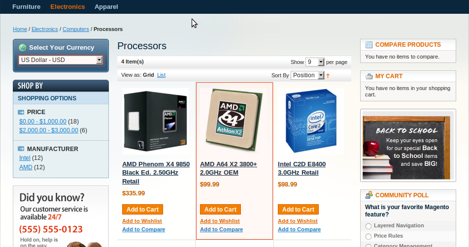
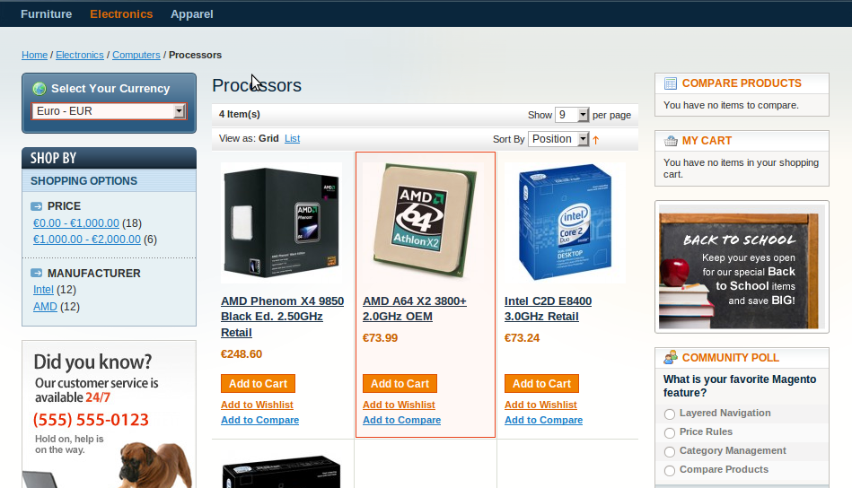

Set the desired currency price fro each currency:

In administrator panel: Catalog -> Manage Products -> Edit Product -> Prices -> Price Per Currency. Save changes.

 

Now when a customer comes to your Magento-based store he will see this:

 

Choose a current currency with the currency selector block and check the results.

