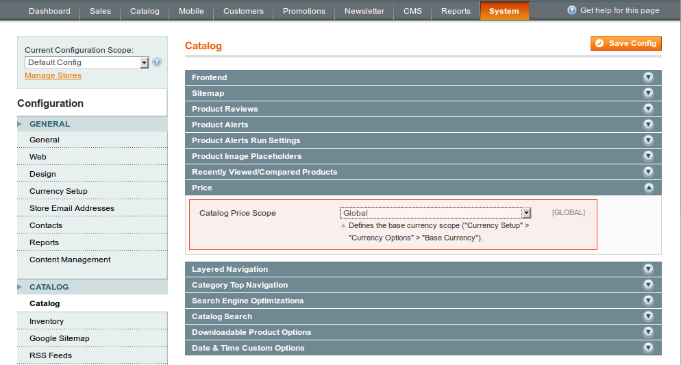

The module ties product price scope that can be set in Magento configuration to the next attributes: Price, Special Price, Special Price From Date, Special Price To Date, Group Price, Tier Price and Base Currency.

In admin panel navigate to: System > Configuration > Catalog > Catalog > Price. Once Catalog Price Scope is changed and saved the tied attributes scope comes updated according to the value chosen.

