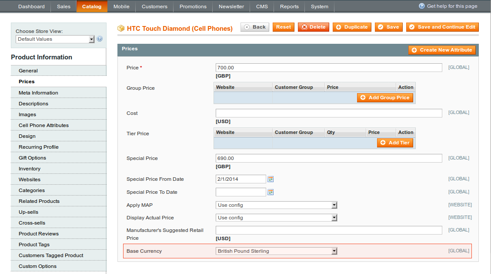

In administrator panel: Catalog > Manage Products. Click edit product or create a new one.

Product Base Currency appends the Base Currency attribute at the end of Prices tab for Simple, Configurable, Virtual, Bundle and Downloadable product types.

 
Once Base Currency is changed the system sets input currency for the next attributes: Price, Special Price, Group Price and Tier Price.