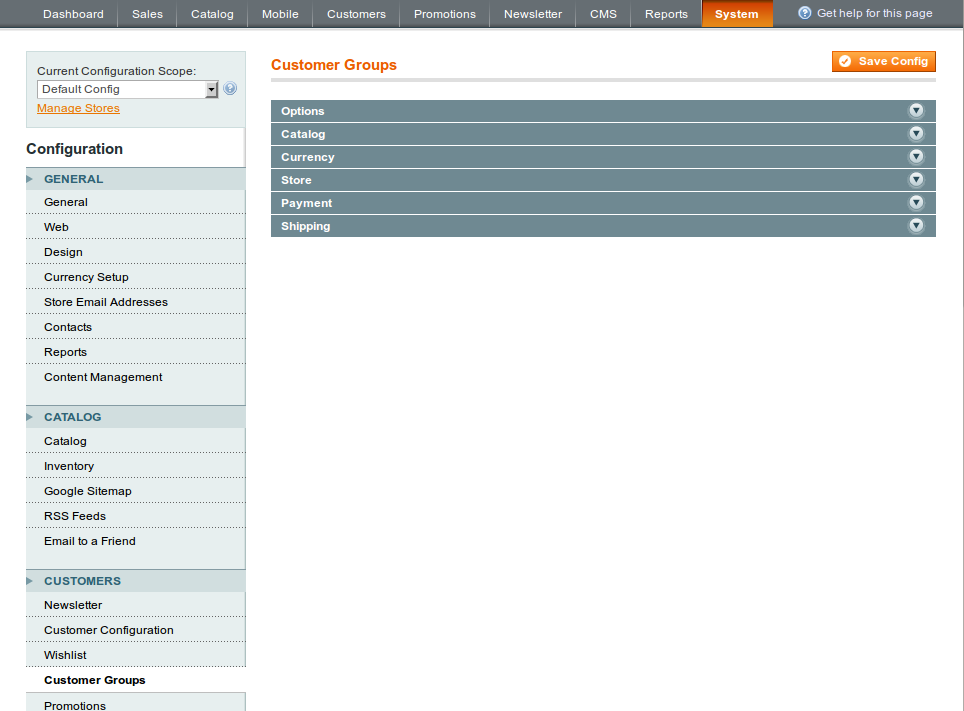
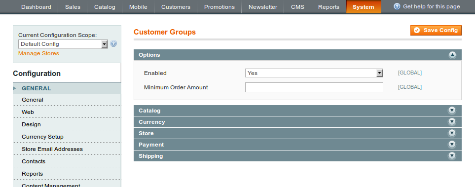
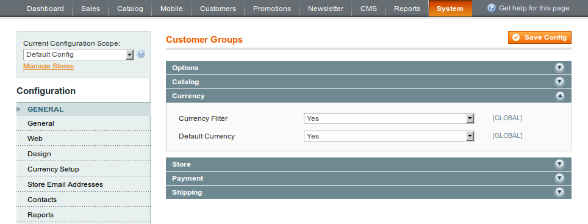
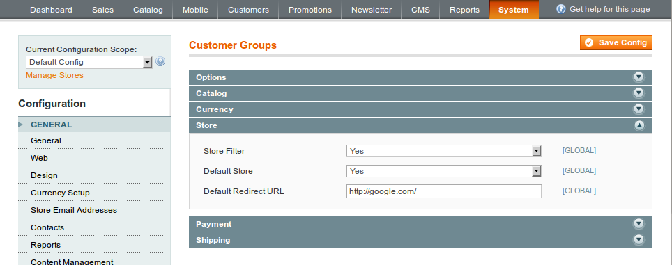
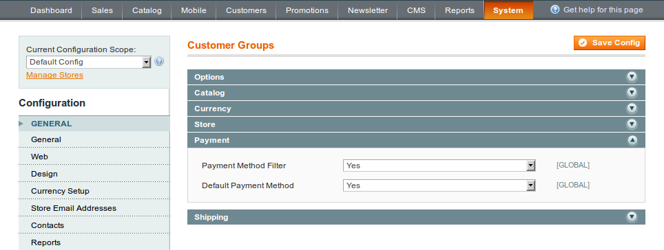
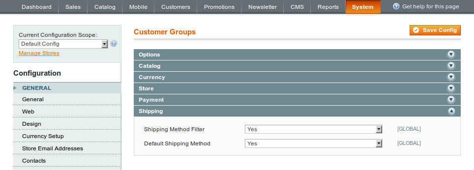

In the admin panel navigate to: System -> Configuration -> Customers -> Customer Groups

 

The next sections are available in the configuration: Options, Catalog, Currency, Store, Payment, Shipping.

 
## Options

 
### Enabled

Here you can enable / disable the module functions globally. This option has a higher priority in the module.

### Minimum Order Amount

The minimum order amount for all customer groups.

Note: Minimum order amount should be enabled in the system in order to get this function into effect: System -> Configuration -> Sales -> Sales -> Minimum Order Amount

## Catalog

![Customer Groups Manager - Configuration - Catalog](customer-group-configuration-catalog.png 

This section is dedicated to catalog specific options.

### Category Filter

The product category filter can be enabled / disabled here.

### Product Filter

Turn the product filter on / off.

## Currency

### Currency Filter

Enable / disable currency filters here.

### Default Currency

Allow default currency here.

## Store

### Store Filter

Enable / disable store filters here.

### Default Store

Allow default store here.

### Default Redirect URL

The default redirect URL in case a store is forbidden for a visitor.

## Payment

### Payment Method Filter

Enable / disable payment methods filter.

### Default Payment Method

Allow default payment method.

## Shipping

### Shipping Method Filter

Enable / disable shipping methods filter.

### Default Shipping Method

Allow default shipping method.
