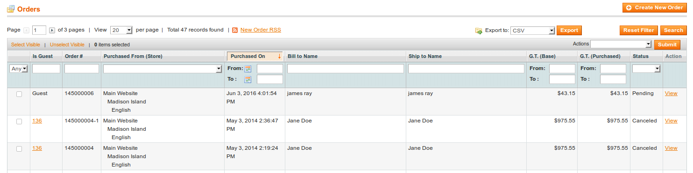
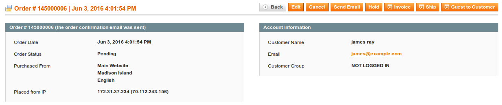
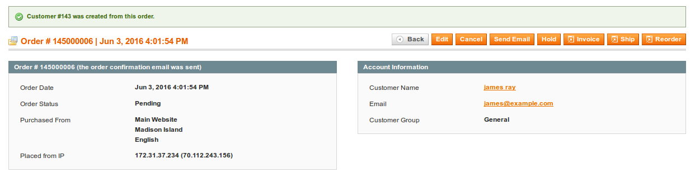

### Order Grid with New Column

If you have guest orders in your store prior to installing this extension you will be able to easily see which orders where purchased by guests. We've added a new column to the order grid "Is Guest". 

1. In this column if the order belongs to a customer you will see the customer's ID and it will be linked to the customers account.
1. If the order is for a guest you will see the word Guest.

This makes it quick to locate which orders have been registered by guests so that you can convert them into Customer accounts.

### A New Option to Convert Guests to Customers

Upon opening a guest order you'll see the newly added button to the top right of your screen. It should exists next to the SAVE option. When you click this button it will do the following:

1. Checks to see if the order was partially converted and needs to be fixed.
1. Checks to see if the customer already exists, using the email address provided.
1. Creates the customer's account if it doesn't exist.
1. Associates the order with the customer's account.
1. Converts the order to a customer order instead of a guest order.

