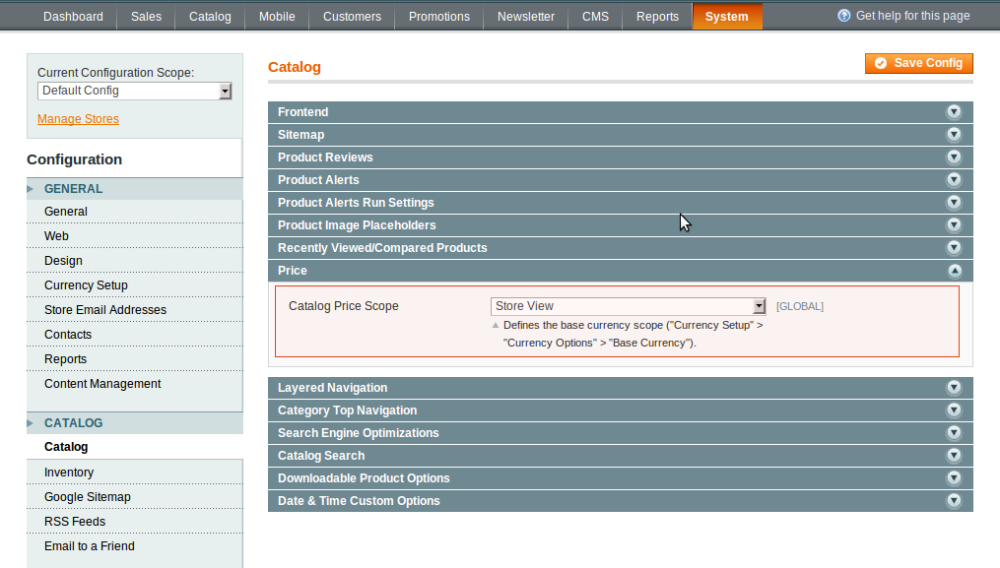

To enable Store View Pricing, follow these steps:

In the administrator panel: System -> Configuration -> Catalog -> Catalog -> Price -> Catalog Price Scope -> Store View. Press the  Save Config button, regenerate the Product Prices index.

 

Opt Global or Website, if you want to disable Store View Pricing.

In the administrator panel: System -> Configuration -> Catalog -> Catalog -> Price -> Catalog Price Scope -> Global / Website. Press the Save Config button.
