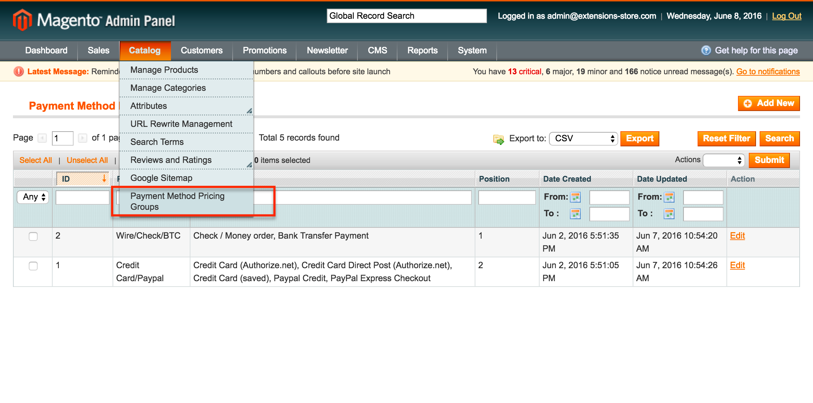
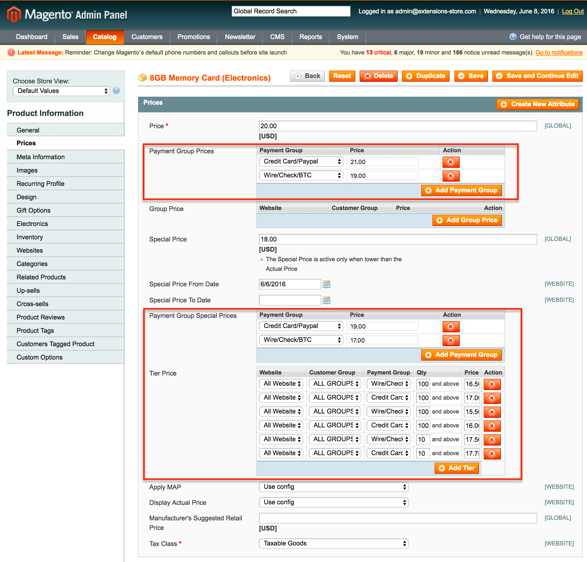
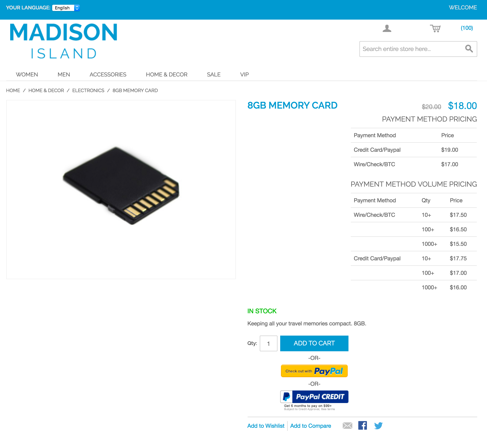
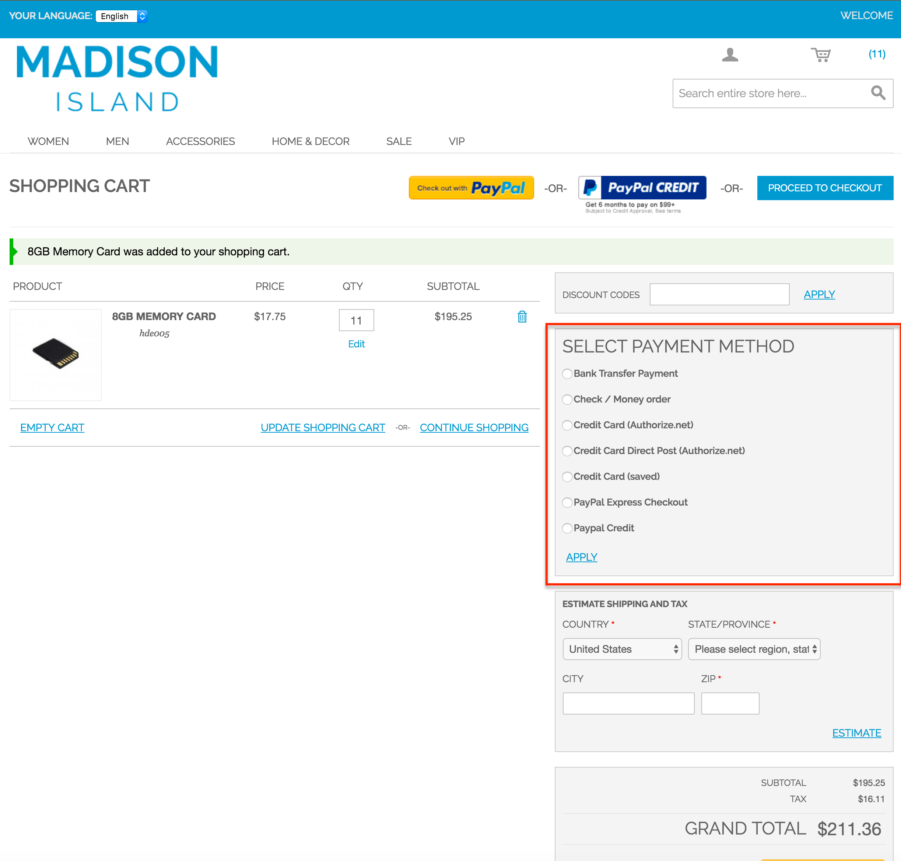

Set up your payment groups and assign payment methods to your groups:

 

Once your payment groups are ready, set your products prices as needed:

 

On the product's front end, the payment groups prices will be displayed:

 

In the cart, user can select the payment methods they want to pay with and prices will reflect their selected payment method:

 

