First, you need to have symlinks allowed in the System -> Configuration -> Advanced:

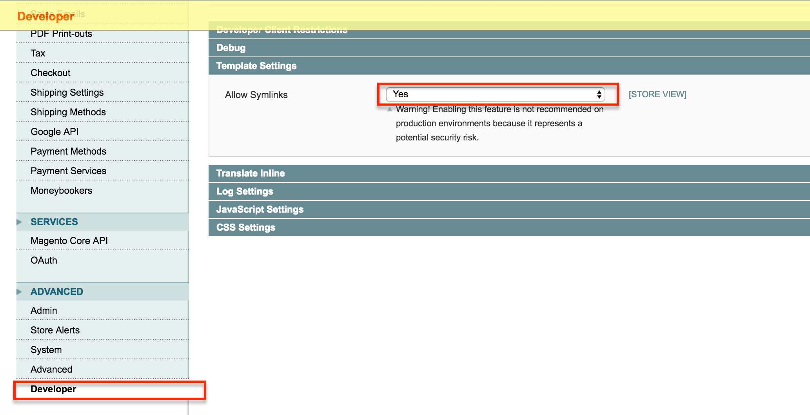

Set up the Payment Methods you want to accept on your site.
Navigate: Admin -> System -> Configuration -> Sales -> Payment Methods. On this page, add all the Payment Methods you would like to use:

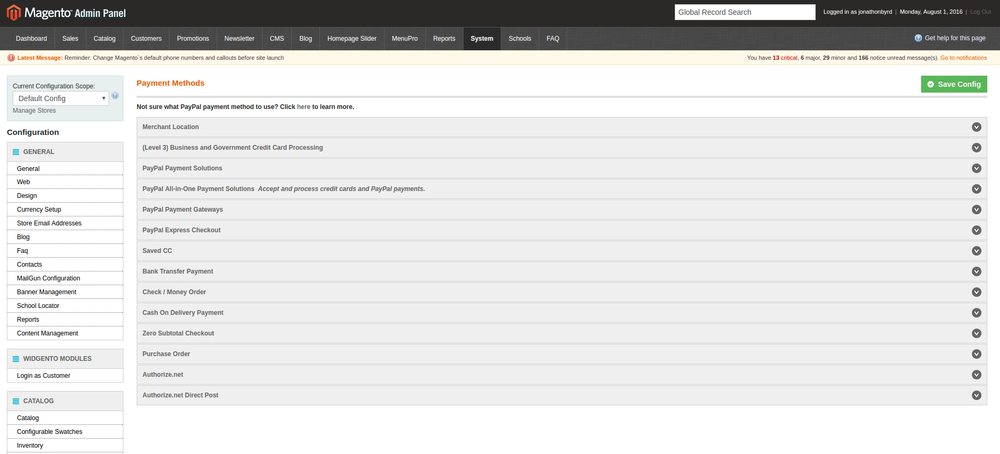

Set up your payment groups and assign payment methods to your groups:

 

Here, you create your Pricing Groups. Inside of each Pricing Group, there are Payment Methods. For example, I have the Payment Groups: Offline Payment & Debit Card:

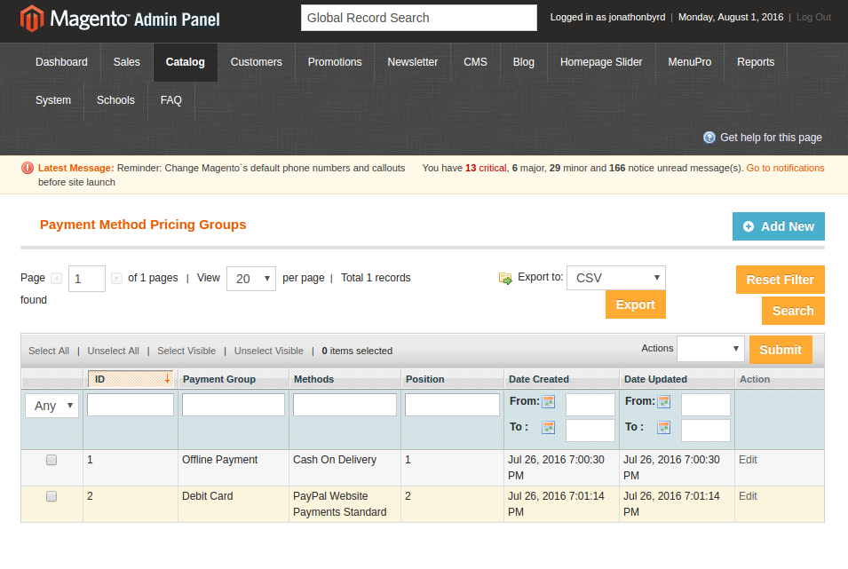

Next, set the specific Payment Methods for that Payment Group. For example, you would put Cash on Delivery and/or No Payment Information Required for the Offline Payment Group. Simply hold Ctrl and click the Payment Methods you want. You can specify the Position for each Payment Group 1 or 2, it doesn't affect anything.

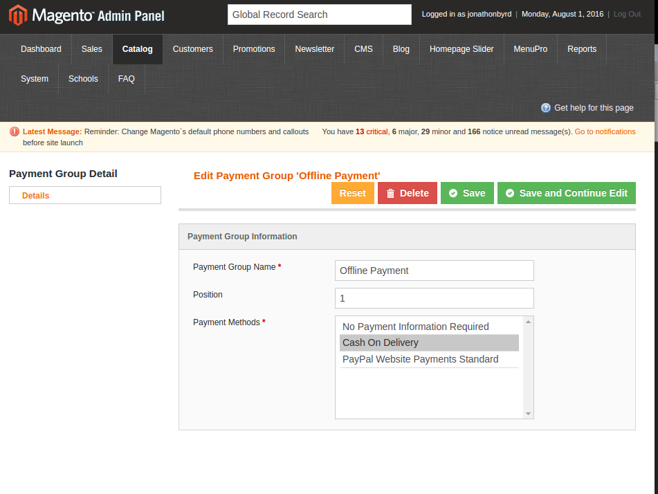

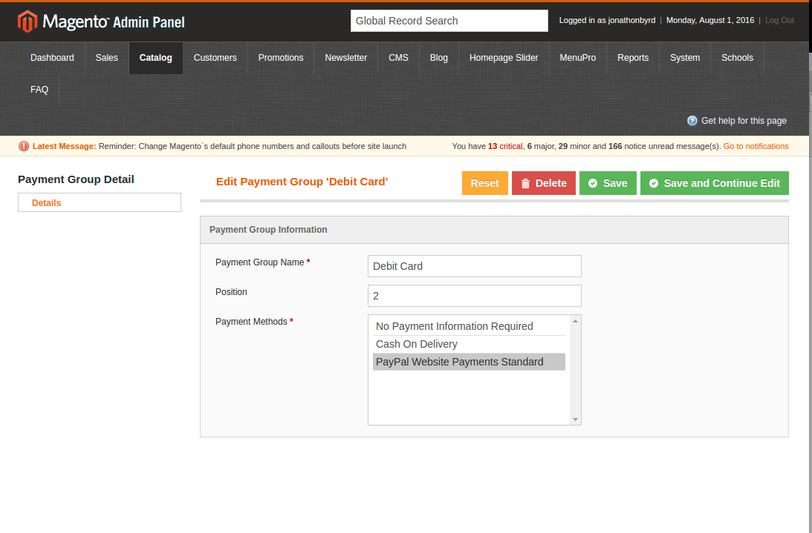

Once your payment groups are ready, set your products prices as needed. On this page, you set the Price, Payment Group Price, Payment Group Special Prices and Tiered Prices. 
* Special Price = When you feature a product for a set period of time
* Tiered Pricing = Offering better prices when customer purchases higher volume of product
Make sure to select "Save" once you're finished. Once you do that, you'll see a green alert message saying, "The product has been saved".

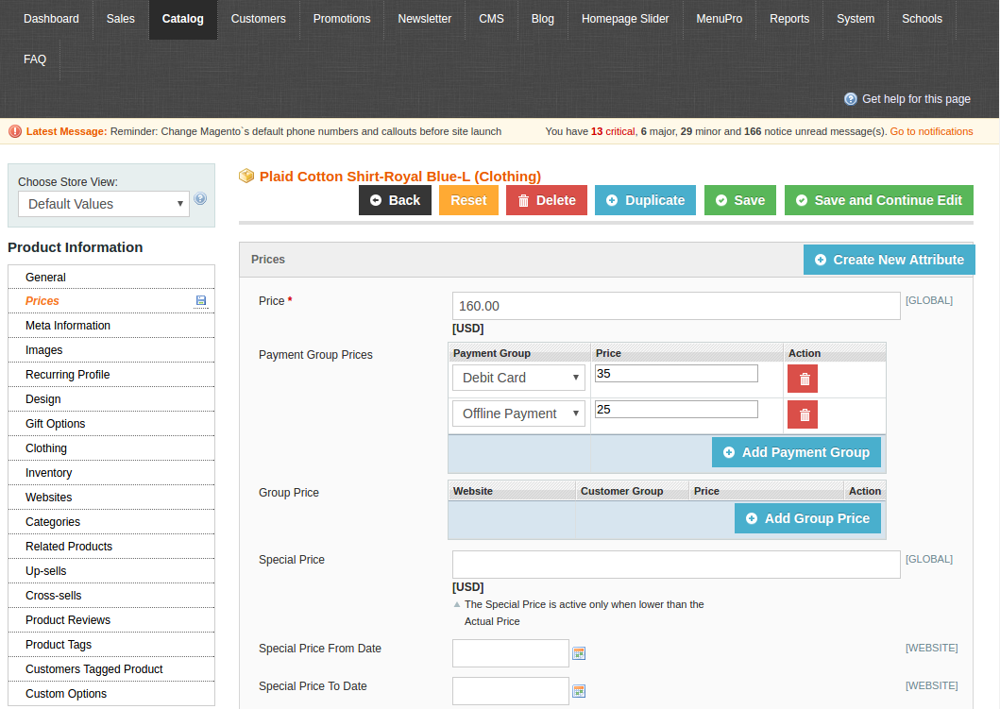

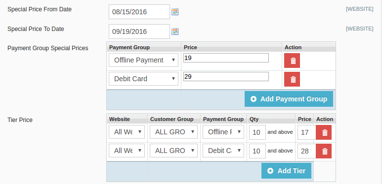

On the product's front end, the payment group prices will be displayed. The product, Plaid Cotton Shirt - Royal Blue -L, displays the Payment Method Pricing and the Tiered Pricing on the product page. 

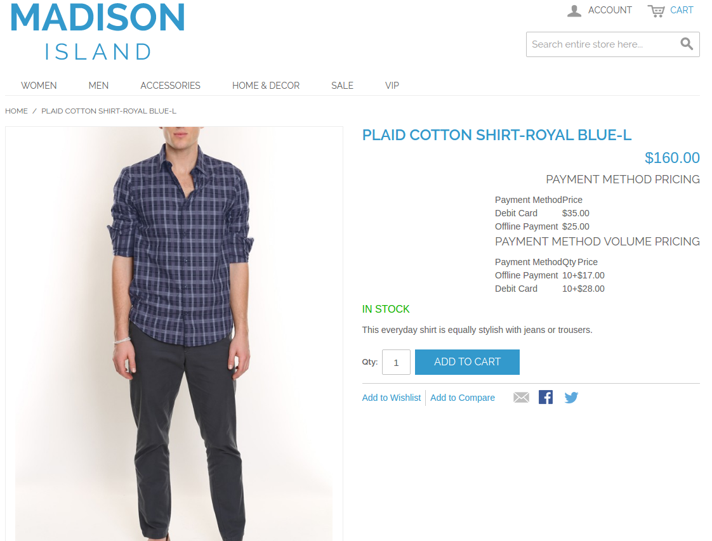

In the cart, users can select the payment methods they want to use and the prices will reflect their selected payment method:

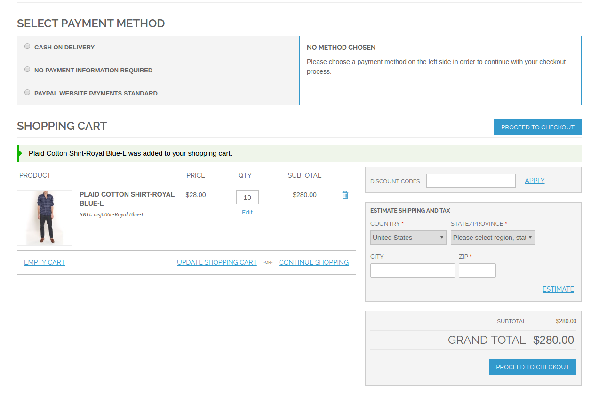

As you can see, the total price adjusts per payment method selected. Below we have examples of when Authorize.net is chosen and when Cash on Delivery is chosen:

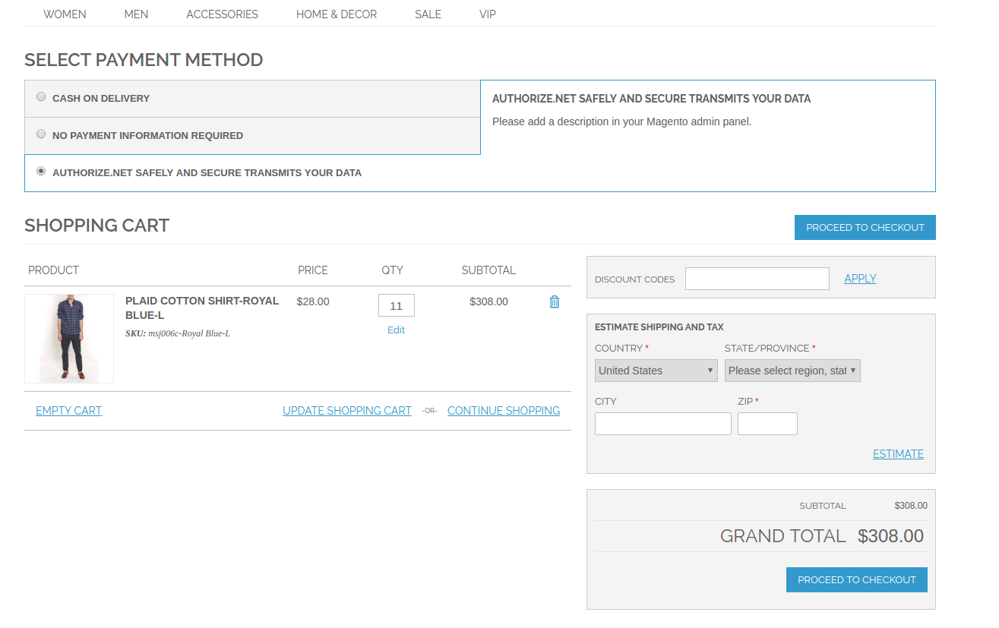

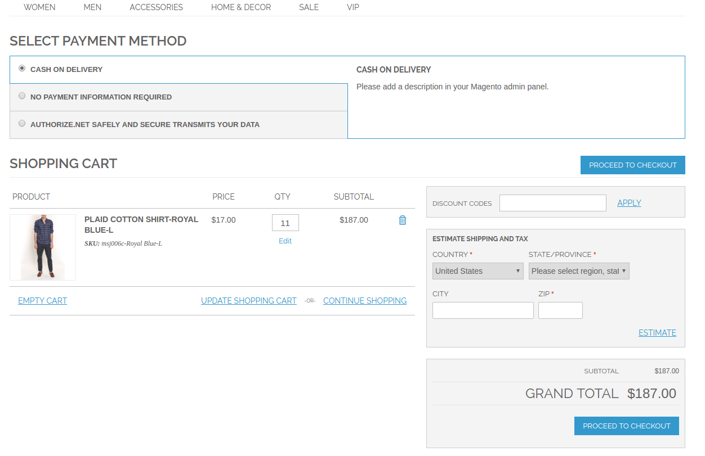

