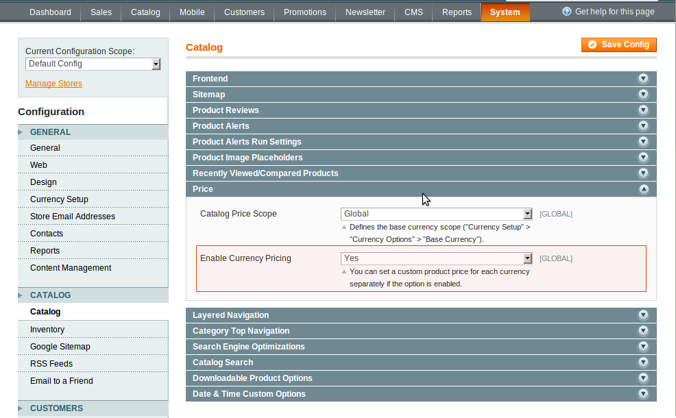

To disable the Price Per Currency feature:

In administrator panel: System -> Configuration -> Catalog -> Catalog -> Price -> Enable Currency Pricing -> No. Press the Save Config button, regenerate the Product Prices index following the alert link.

 

Now all the prices in the frontend will be displayed in accordance with the currency rate setted by you in the Manage Currency Rates screen. At the same time, you have no ability to establish custom product prices for various currencies in the backend.

Naturally, to enable Price Per Currency switch above option to Yes:

In administrator panel: System -> Configuration -> Catalog -> Catalog -> Price -> Enable Currency Pricing -> Yes. Press Save Config button, regenerate Product Prices index following alert link.
