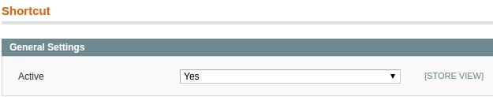

## Configuration

In this article, we’ll look at the "Edit Buttons" extension options. Please follow this sequence of steps:

In administrator panel: System -> Configuration -> Merchant Protocol -> Shortcut. You’ll eventually see this:

## General Settings

**Active**

Enable and disable the module
