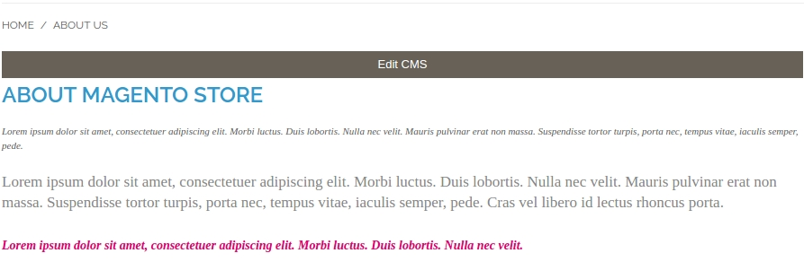
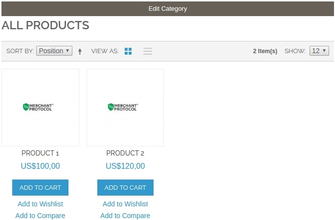
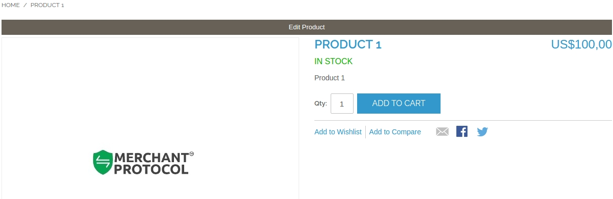

## How to Use?

To edit the following pages you need to log in to the admin.

## CMS Pages

You’ll eventually see this:

**Edit CMS**

Referral link to redirect you the CMS page editing in administrative area.

## Categories

**Edit Category**

Referral link to redirect you the category editing in administrative area.

## Products

**Edit Product**

Referral link to redirect you the product editing in administrative area.
