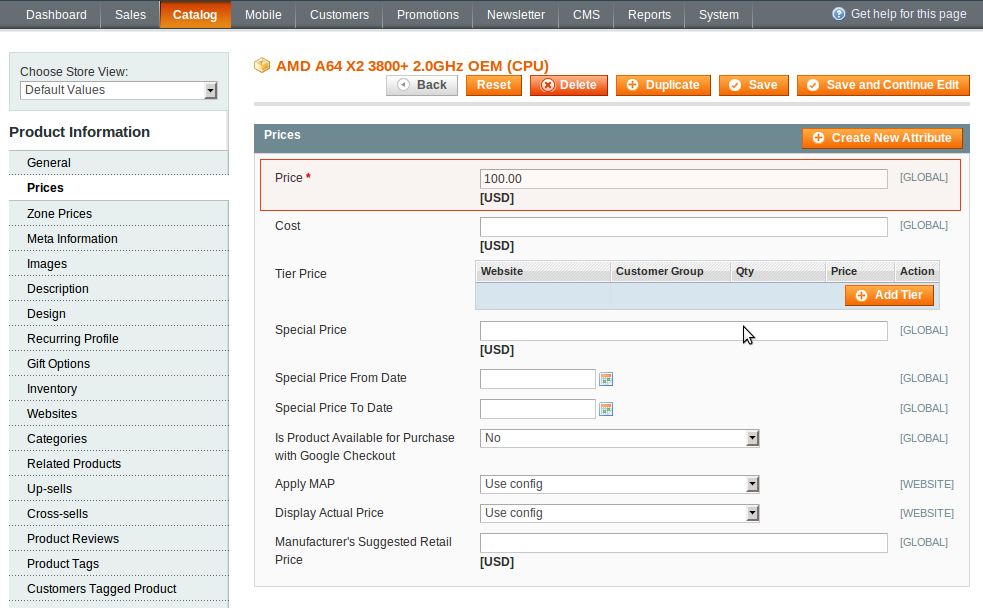
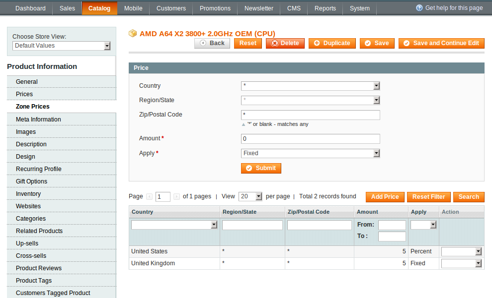
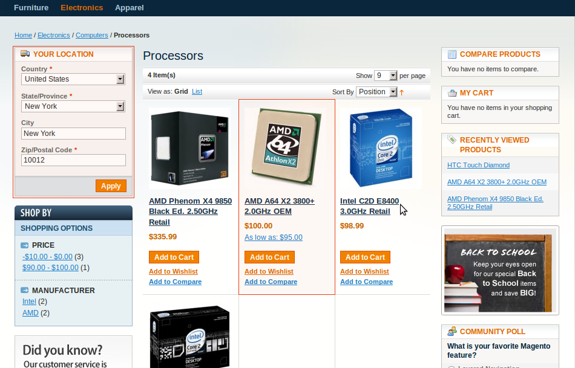
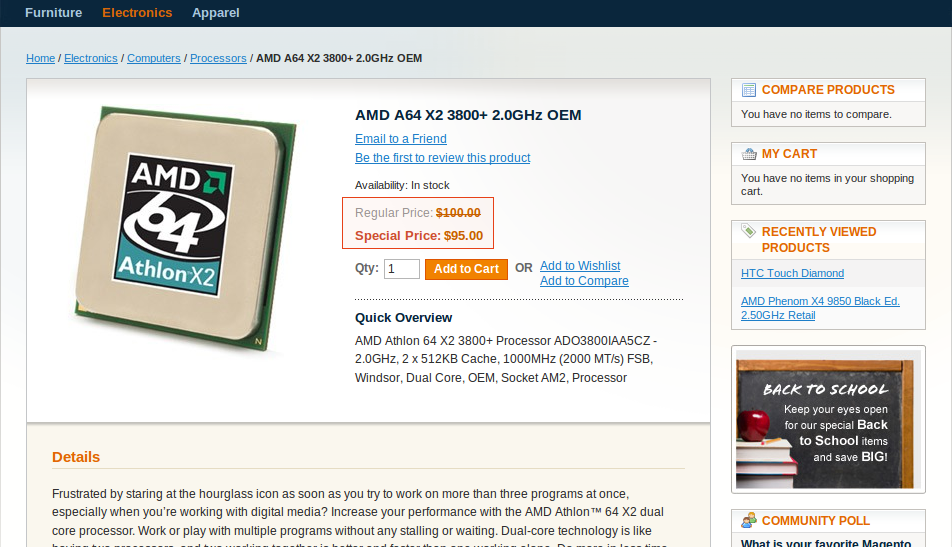

Zone Pricing can help you set proper product prices by country / region / state / zip / postal code.

In administrator panel: Catalog -> Manage Products -> Edit Product -> Zone Prices.

 

Now you can set prices per zones:

 - Country – Choose a particular country from the drop down list;
 - Region / State – Choose a particular region / state if required;
 - Zip / Postal Code – Enter zip / postal code if required;
 - Amount – Enter discount value;
 - Apply – Select percentage discount or fixed amount to deduct from the price;

Don’t forget to press the Submit button.

If you want to delete/edit the prices go to the Action column.

Assume that you have provided 10 percent discount on a Product A for United States. The visitor will see the product price with the discount according to his place of residence. The visitor's location can be adjusted manually with the Customer Locator function.

 

 
