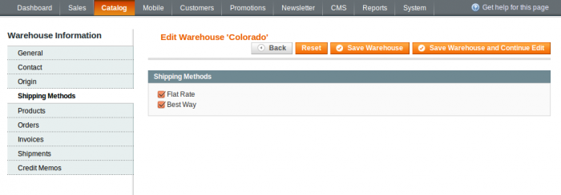

In this article, we’ll look at the Multi-Warehouse extension options. Please follow this sequence of steps:

In administrator panel: System -> Configuration -> Catalog -> Warehouses. You’ll eventually see this:

This may also be represented in another form:

In turn, Options can be represented by the following diagram:

1. Mode

You can choose between two modes: Multiple and Single. Say, you have a web store configured with multiple warehouses. The shop administrator, selecting one of the two modes, can allow shipping from multiple warehouses or from a single warehouse. We’ll talk about it in the [Multiple Warehouse Modes](http://merchantprotocol.com/multiple-warehouse-single-mode/) article.

2. Enable Shipping Method Filtering

As you know, there are different shipping methods such as: Flat rate, Table rate, FedEx, UPS, USPS, Canada Post, Royal Post, Free Shipping and so on. This option makes it possible to filter available shipping methods for each warehouse individually. For instance, for a Canada warehouse you can apply the Canada Post as the only available shipping method. If set to Yes, the option is enabled. If the option is set to No, then the filtering will be disabled. If the option is enabled then the Shipping Methods tab becomes available to edit the warehouse page.

 
3. Enable Discount

Any of your products can be listed in several warehouses. With this option, you will be able to offer discounts for the same product, specific to the warehouse. Hence, you will have a different product price for each warehouse. Yes – the option is enabled. No – the option is disabled. If the option is enabled, then the Price Adjustment field comes available to edit in the product Prices tab.

4. Enable Shelves

You can store the shelves information for each product using the Shelf Information tab if the option is enabled.

 
5. Show Warehouse Information

A seller, at his discretion, may allow customers to see the warehouse information. Yes – observe the warehouse data. No – doesn't observe the warehosue data.

6. Show Warehouse Description

You can write a description about your warehouses and share this information with customers. Select this option if you want your customer to view the description. The Warehouse Information option must be enabled to make the Show Warehouse Description visible. 
