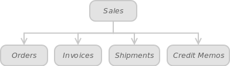

Admin panel: Sales

In turn,

 

Each of the tables shown in Figure 8.1. has a Warehouse column that let's you filter your orders, invoices, shipments and credit memos by a particular warehouse. Sort the data by selecting a required warehouse from the dropdown list.
