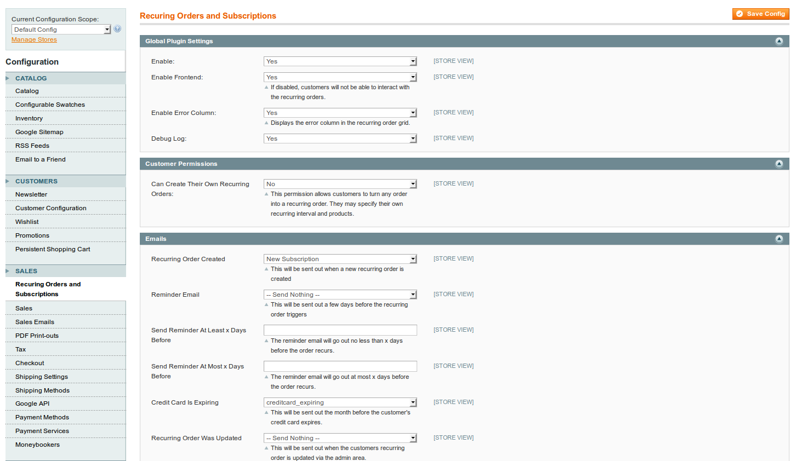

## Configuring Recurring Orders and Subscriptions

There are a number of configuration options available in the Magento System Configuration area. Follow this breadcrumb to the navigation area:

`System (primary nav) > Configuration (drop nav) > Sales (sidebar section) > Recurring Orders and Subscriptions (sidebar nav item)`

#### Global Recurring Settings

**Enable : Yes** this setting will enable the cron and display settings for the admin and frontend.

**Enable : No** removes all recurring templates from the admin and frontend. This also disables all cron jobs.

 * * * 

**Enable Frontend : Yes** customers will be able to see their recurring orders and create new ones.

**Enable Frontend : No** customers will not see the effects of recurring orders on the frontend and trigger products will not be used. All recurring orders must be created from the admin area.

 * * * 

**Enable Error Column : Yes** enables an error column in the recurring order grid. disables subtotal, shipping, and tax columns in the recurring order grid.

**Enable Error Column : No** hides the error column in the recurring order grid and enables the subtotal, shipping, and tax columns.

 * * * 

**Debug Log : Yes** as the cron processes orders many debug statements and values will be appended to `var/log/recurring_place_orders.log` making it possible to see where errors are happening.

**Debug Log: No** disables output to the `var/log/recurring_place_orders.log` file.

#### Customer Permissions

This section focuses on those permissions that you will be giving to customers in their "My Account" area.

**Can Create Their Own Recurring Orders** This permission, when set to YES, gives your customers the ability to convert their past orders into regular recurring orders. Customers have the full range of permissions on orders that they create themselves.

#### Emails

This extension uses the Transactional Email system that is part of native Magento. Simply create the email templates using the Transactional Emails and choose them in this section. There are a number of email variables that can be called within these Transactional Emails, those are identified in the next section.

**Recurring Order Created** this email will be sent out when a recurring order is created. Typically this happens when the customer checks out with a trigger product or when the Admins create a recurring order.

**Reminder Email** this email will be sent out `X` days before the actual recurring order processes each interval.

**Send Reminder At Least x Days Before** starting this many days before the recurring order, the system will trigger the recurring order. If for any reason this date is missed for unforeseen circumstances it will reattempt the sending of this email until the next setting.

**Send Reminder At Most x Days Before** if the reminder email has not yet been sent, the system will stop attempting to send it this many days before the recurring order processes.

**Credit Card Is Expiring** after each recurring order is processed a check will take place against the credit cards expiration date. If the credit card is going to expire before the next interval, then this email will be sent to the customer. Read more about our Credit Card expiration system in these docs.

**Recurring Order Was Updated** whenever the recurring order is saved with new data, this email will be sent to the customer.

**Recurring Order Cancelled** when a recurring order automatically cancels, or the admins choose to "cancel" the recurring order, this email will be sent to the customer.

#### Dunning Management

There are a number of reasons for a recurring order to fail. Most of the time the recurring order fails due to a declined credit card. There are other reasons, such as a failed billing address or an order with the recurring settings. No matter what the error is caused from, this dunning system will attempt to process the order three more times after it's initial attempt.

**1st Failed Attempt** choose how many days after the initial order date that you want to wait before a failed credit card is attempted again. 

**2nd Failed Attempt** choose how many days after the 1st failed attempt that you want to wait before the order is attempted to be processed again.

**3rd Failed Attempt** choose how many days after the 2nd failed attempt that you want to wait before the order is attempted to be processed again.

**Then Finally** this option allows you to cancel the recurring order and send a cancellation email to the customer, or just ignore the recurring order and let it sit enabled in the system until it's manually edited again.

**Recurring Order Failed** this is the email that will be sent out each time the recurring order is attempted and fails. This should be a generic email and use the proper variable for displaying the error to the customer.

**From Expired Comes Default : Yes** When a customer receives a credit card expiring email they have the option to enter a new credit card. When they do, this option will make the new credit card the default on their account.

**From Expired Comes Default : No** if set to NO, this will only replace the exact card that was expiring on the customers account.

