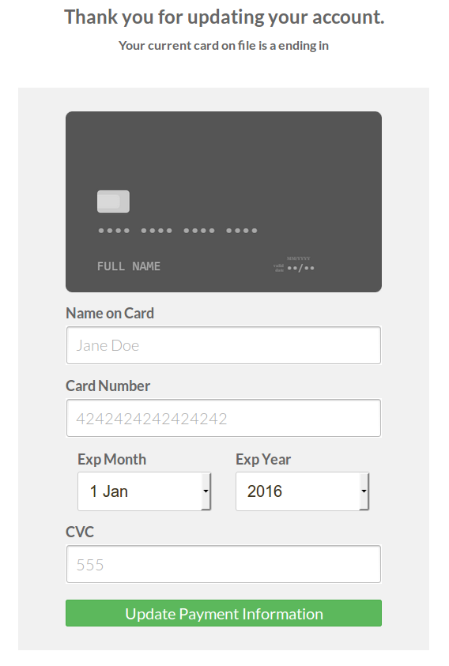

## When Credit Cards Are Expiring

After each Recurring Order is placed a check on the credit cards expiration date is made. If the card will be expiring before the next order is placed, then an email will be sent to the customer.

1. Read the "Email Variables" document to see how to include the "Expired Url" in the Transactional Email that you create.
1. Read the "Configuration" document to see how to enable/disable this credit card expiration email.
1. Read the "Configuration" document to see how to specify which Transactional Email to choose.

When the customer receives a Credit Card Expiration Email that includes an "Expired Url", they may follow that url to an interface which gives them the ability to add a new credit card to their account.

> **Developer Note** use the following code snippet to capture a credit card expiration url for testing.
    
    echo Mage::helper('mp_recurring/cards')->getExpiredUrl( $customer_id = 40 );die;

When the customer arrives at the credit card replacement interface provided in the email, they will not be able to see any information associated with the recurring order. Their only option from this interface is the ability to add a new credit card. You may see the "Configuration" document to see how to handle this new card. The default function is to replace only the expiring credit card.

