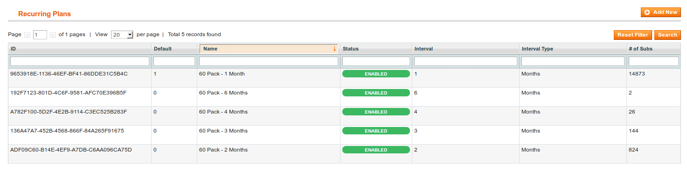
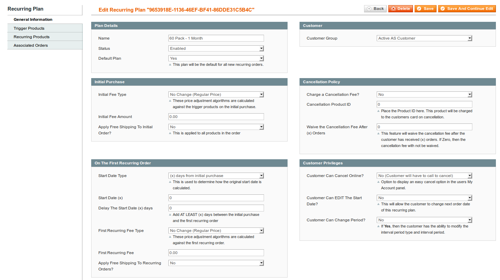

## Recurring Plans

Although Recurring Orders can be created and managed completely independently from Recurring Plans, the plans make it easier to manage Recurring Orders in bulk. Recurring Orders will first look to their individually defined settings, if those settings have not been configured the orders will look to their parent Recurring Plan for the default settings.

You're not limited to the number of Recurring Plans that you need to define. You may create as many plans as you would like.

There are many options available for the recurring plans that make it possible to completely tailor a subscription service to your unique needs.

### Plan Details

* **Name** This is the name of the Recurring Plan that will be displayed to the customers in various messages throughout the frontend and provided emails.
* **Status** Disabling a plan will disable ALL related Recuring Orders and render the current plan innactive. No new Recurring Orders will be created against the Recurring Plan.
* **Default Plan** By selecting the current Plan as the default it will be preselected for all new Recurring Orders that administrators create.

### Customer

* **Customer Group** New customers signing up for this recurring plan will be assigned to the customer group that has been selected here.

### Initial Purchase

These settings effect the customer during checkout of a trigger product. The following algorithms are only assigned to the trigger product managed by this recurring plan. At this time the recurring order will be created for the customer and this is considered the initial purchase.

* **Initial Fee Type** The initial fee type adjusts the trigger product price on the original purchase. 
* **Initial Fee Type : No Change (Regular Price)** The price of this initial trigger product will not be adjusted.
* **Initial Fee Type : 100% Free** The trigger product in the initial purchase will be 100% free.
* **Initial Fee Type : Percentage Price Adjustment** The price of the trigger product will be adjusted by "Initial Fee Amount" percent.
* **Initial Fee Type : Fixed Price Adjustment** The price of the trigger product will adjusted by "Initial Fee Amount".
* **Initial Fee Type : Fixed Price** The price of the trigger will be set to "Initial Fee Amount".
* **Initial Fee Type : Prorated to start date** The trigger product will be prorated by the number of days between the initial purchase date and the start date of the recurring order.
* **Initial Fee Amount** The amount set here will be used in conjunction with the "Initial Fee Type" algorithm chosen in the previous step.
* **Apply Free Shipping To Initial Order?** If set to yes, the shipping will be free for this initial purchase.

### Cancellation Policy

* **Charge a Cancellation Fee?** If set to yes, when the Recurring Order is cancelled there will be one final order created using the Cancellation Product ID chosen in the next field.
* **Cancellation Product ID** The ID of the product to charge the customer for when their Recurring Order is cancelled.
* **Waive the Cancellation Fee After (x) Orders** If the cancellation fee is enabled and the customer has had (x) orders processed, then the cancellation fee will be wavied.

### On The First Recurring Order

* **Start Date Type** The start date type is an algorithm that's used to define what the initial start date will be for new recurring orders.
* **Start Date Type : Regular Recurring Period** If chosen, "The Recurring Interval Period" will be used. 
* **Start Date Type : (x) dates from initial purchase** This algorithm will set the recurring order's start date to (x) days after the original purchase. 
* **Start Date Type : On the next (x) day of the Week** This algorithm will set the recurring order's start date to the next (x) day of the Week.
* **Start Date Type : On the next (x) day of the Month** This algorithm will set the recurring order's start date to the next (x) day of the Month.
* **Start Date Type : On the next (x) day of the Year** This algorithm will set the recurring order's start date to the next (x) day of the Year.
* **Start Date (x)** This value is used in conjunction with the "Start Date Type" above.
* **Delay The Start Date (x) days** There may be some situations where you want the recurring order's start date to begin on the first day of the Month, but not within the next thirty days. In that case, you would delay the start date at least thirty days with this option.
* **First Recurring Fee Type** This option is used to define the pricing of the first recurring order.
* **First Recurring Fee Type : No Change (Regular Price)** When selecting this algorithm no change in price will be done to the first recurring order.
* **First Recurring Fee Type : 100% Free** This algorithm will cause the first recurring order to be 100% free.
* **First Recurring Fee Type : Percentage Price Adjustment** This algorithm will adjust the first recurring order's price by the percentage set in "First Recurring Fee".
* **First Recurring Fee Type : Fixed Price Adjustment** This algorithm will adjust the first recurring order's price by the the amount set in "First Recurring Fee".
* **First Recurring Fee Type : Fixed Price** This algorithm will set the first recurring order's price to the amount set in "First Recurring Fee".
* **First Recurring Fee Type : Prorated to start date** This algorithm is not used.
* **First Recurring Fee** The amount set here will be used by various algorithm chosen in "First Recurring Fee Type".
* **Apply Free Shipping To Recurring Orders?** By setting this value to yes, all recurring orders will receive free shipping.

### The Recurring Interval Period

* **Interval Period Type** This option in conjunction with "Interval Period Unit" will be used to set the regular recurring interval that the recurring orders are processed on.
* **Interval Period Unit** The number of interval types in a given interval period.

### Customer Privileges

* **Customer Can Cancel Online?** If set to yes, the customer will be able to cancel their subscription from their "My Account" area.
* **Customer Can EDIT The Start Date?** If set to yes, the customer will be able to change their recurring order's order date from their "My Account" area.
* **Customer Can Change Period?** If set to yes, the customer will be able to change the recurring interval associated with their recurring order.

### Order Automation

* **Recurring Shipping Method** This is the shipping method that will be used for all Recurring Orders under this plan.
