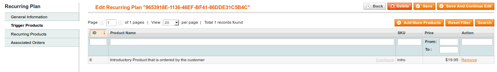

## Trigger Products

Customers do not purchase Recurring Plans directly instead they purchase products which trigger a subscription to a Recurring Plan. The customer only needs to purchase one of the trigger products in order to trigger the subscription. The pricing of this trigger product can be adjusted when editing the Recurring Plan - Initial Purchase section. If no trigger product is assigned to a Recurring Plan, the plan will not automatically create new Recurring Orders for customers.

To assign a trigger product to a Recurring Plan, edit the plan and choose the Trigger Products Tab in the left sidebar.
