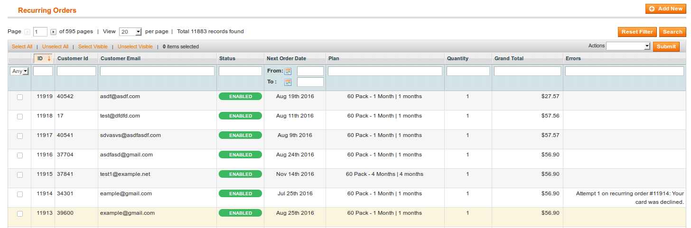
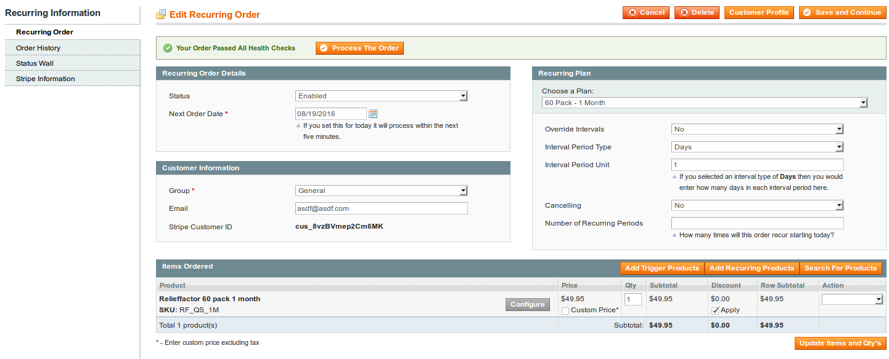
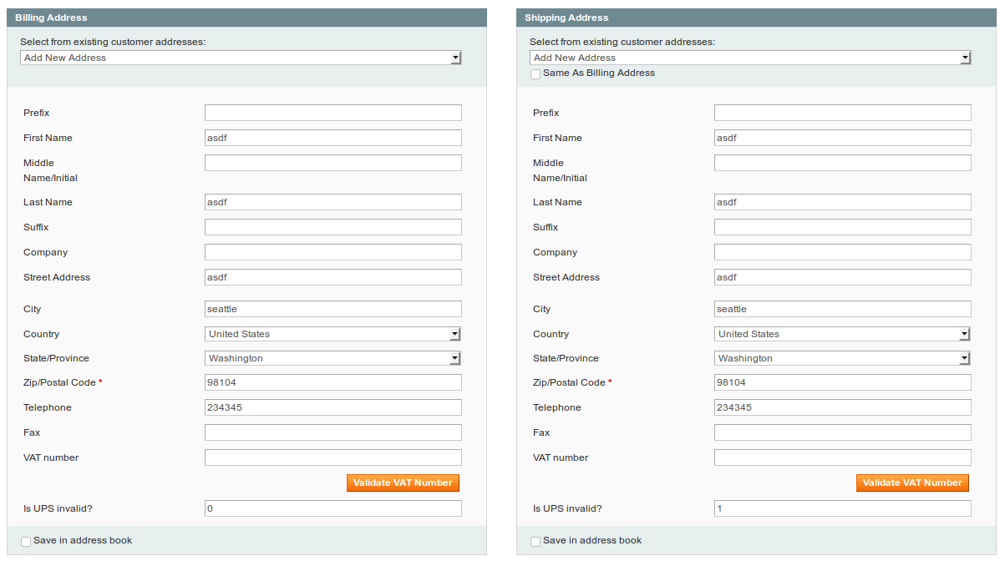
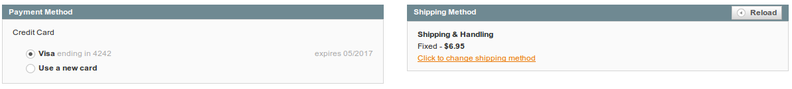
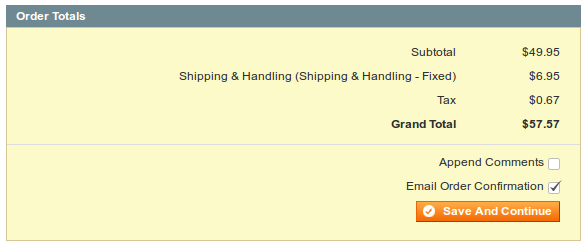
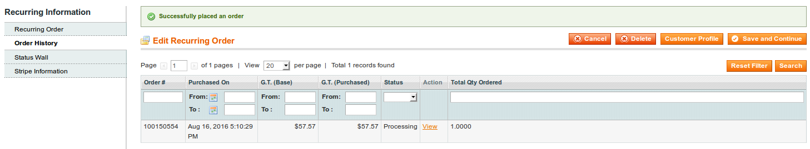
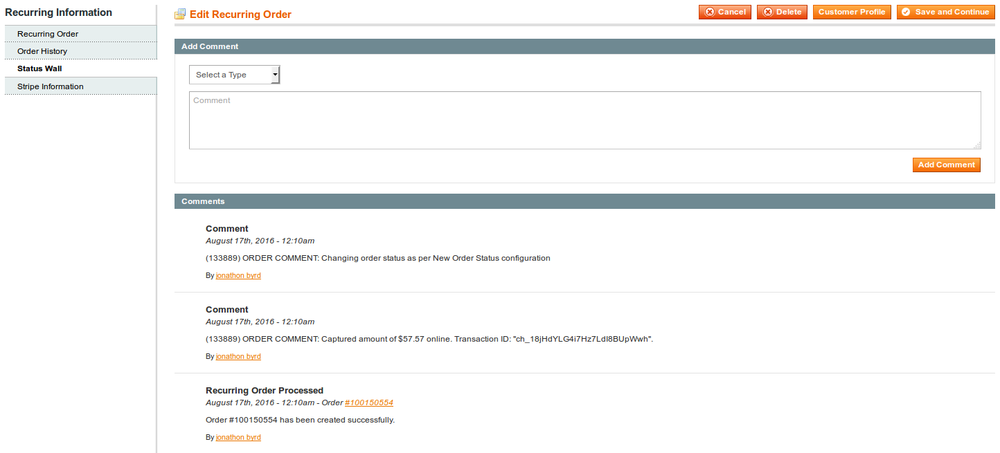

## Recurring Orders

The Recurring Order grid will show all of the recurring orders that have been created. Disabled, Cancelled, and Enabled Recurring orders will show in this grid.

By default you'll be able to see the pricing that was last charged by the recurring order. You may enable an "Error" column from the Configurations area. This Error column will allow you to see why Recurring Orders have not been placed on the order date set.

When clicking on any of the Recurring Orders in the list you will have the ability to edit the Recurring Order.

### Recurring Order Details

* **Status** If disabled, the Recurring Order will not process.
* **Next Order Date** This is the date that the order will process on next.

### Customer Information

* **Group** This is the customer group for the related customer.
* **Email** This is the customer's email associated with this recurring order.

### Recurring Plan

* **Choose A Plan** All of the recurring plans that you've created will display here. You may select a Recurring Plan to assign it as the parent.
* **Override Intervals** If set to yes, the following interval settings will override the parent Recurring Plan.
* **Interval Period Type** The interval type that is used in conjunction with the "Interval Period Unit" to create the regular recurring schedule for orders.
* **Cancelling** If set to yes, this order will automatically cancel after "Number of Recurring Periods" reaches zero.
* **Number of Recurring Periods** This is the number of recurring orders that will be created before the recurring order is cancelled. This number will decrease by one, each time a the order is processed.

### Items Ordered

This is a list of products that will be charged to the customer each time the recurring order is processed. You may adjust the products that are assigned to the recurring order using the buttons in this row.

Inventory is still managed for all products involved. If you do not have the inventory available, the recurring order will fail when attempting to process.

* **Add Trigger Products** will assign all of the trigger products from the parent Recurring Plan to this order.
* **Add Recurring Products** will assign all of the recurring products from the parent Recurring Plan to this order.
* **Search For Products** will allow you to locate any product in the catalog and assign it as the items to be ordered.

#### Billing and Shipping Addresses

You may select an existing billing and shipping address, or enter a new one.

#### Payment and Shipping Methods

The Recurring Order and Subscription extension will work with two different payment gateways, Stripe and Merchant Protocol. Those payment methods will display under this payment method block when active. You will be able to select existing customer cards or enter new customer cards for the given recurring order.

The Shipping Method will automatically be set to the shipping method defined by the parent Recurring Plan. You have the option to change the shipping method by clicking on the "Reload" button shown here.

#### Order Totals

The Recurring Order Totals shown here are calculated based upon the currently active products that have been associated with this recurring order.

### Order History

The Order History tab will show you all orders that have been processed by this recurring order.

### Status Wall

All activity on the customer's account is saved in the status wall. You also have the ability to add your own notes. The status wall makes it possible to understand what experience the customer is receiving.
