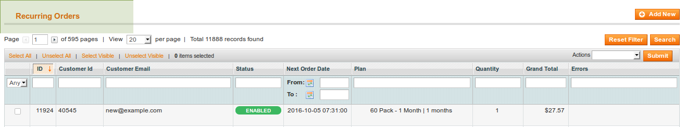
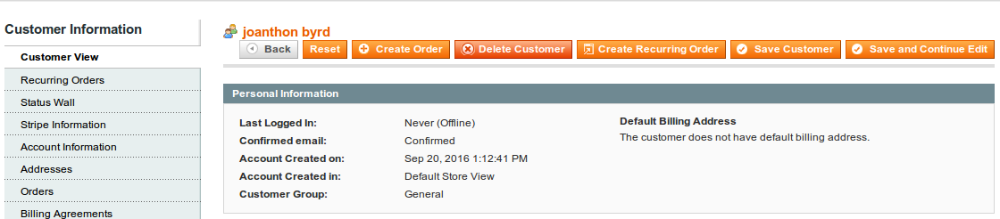

## Automatic Recurring Order on Frontend Checkout

When creating a Recurring Plan you have the ability to assign trigger products. A Recurring Plan may have any number of products and product quantities. When a customer purchases the trigger products associated with a Recurring Plan, they will be setup with a Recurring Order. These trigger products must be purchased together in order for a the customer to be setup with a Recurring Order. The customer may also purchase additional products or quantities and still be setup with a Recurring Order.

If a customer purchases trigger products that match the combinations of multiple Recurring Plans, then the customer will be setup with all associated Recurring Orders. The Recurring Plans act as a template for Recurring Orders, the plans include all of the necessary rules to create a Recurring Order.

## Manually Creating a Recurring Order from the Admin Area

Recurring Orders are not automatically setup for customers from within the Admin Area. Customer Service Representatives have the option to create a simple order, using the default Magento order creation process. CSRs also have the ability to create a Recurring Order using the Recurring Order creation process that this extension provides.

#### Finding the "Create Recurring Order" buttons

There are two locations which a Recurring Order can be created from the Admin Area. When viewing all Recurring Orders in the Recurring Order Grid you will see a button labeled "Add New" in upper right above the grid.

This button will ask you to choose a customer or create a new customer.

The second link for creating new recurring orders exists within the customers profile. When editing a customer from the Admin Area you will see a "Create Recurring Order" button in the upper right corner.

This button will have the customer's account automatically assigned to it when you begin creating a Recurring Order.

#### Associating Recurring Plans with Recurring Orders

When creating a Recurring Order from the Admin Area, CSRs may choose a Recurring Plan to associate with the Recurring Order. Plans make it possible to automatically adjust order pricing and charge cancellation fees. Recurring Orders are capable of having customized recurring intervals with or without a Recurring Plan association, but they are not capable of adjusting their own pricing.

When adjustments are made to the Recurring Plan's rules, those adjustments will carry down to all associated Recurring Orders. Recurring Orders that have the "Override Interval" option set to "Yes" will not obey the Recurring Plan interval options.

#### Assigning Products to a Recurring Order

If a Recurring Order is associated with a Recurring Plan, CSRs may choose to start the order with the plan's trigger products, or start the order with the plan's recurring products. If the CSR chooses to create the Recurring Order with the associated plan's trigger products, then the initial order will be placed with those products. Each additional occurance of the Recurring Order will be placed with the recurring products associated with the plan, not with the trigger products. Only on the first occurance of a Recurring Order will trigger products be replaced with recurring products.

With keeping the rule above in mind, if at any time a Recurring Order, regardless of plan association, has products assigned to it that are not trigger products, those custom products will be used as the recurring products. 
