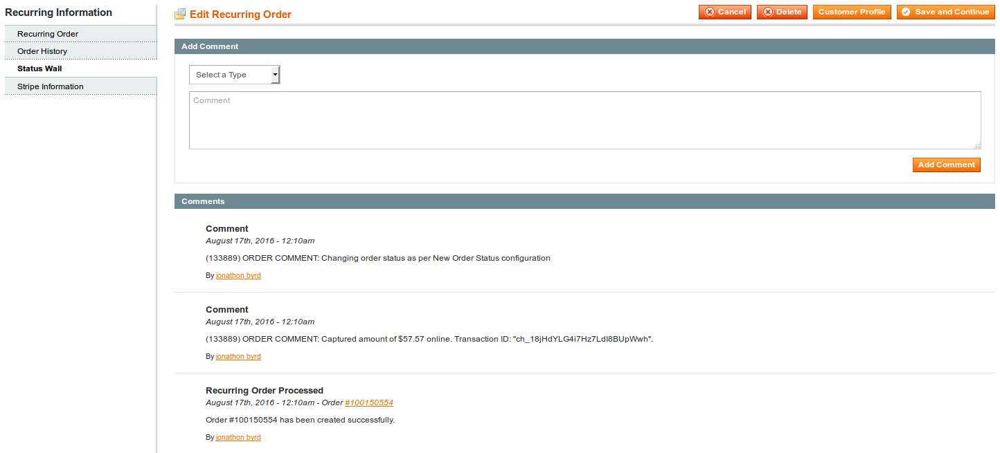

## Status Wall

The status wall tracks all activity associated with the customers account. This will allow you to confirm which emails are being sent to the customer and how often that their order is being processed. You have the ability to add your own activity messages to the wall.

## Global Status Wall

The global status wall is located under the reports tab. You'll be able to see all activity in the system and what is happening right now.
