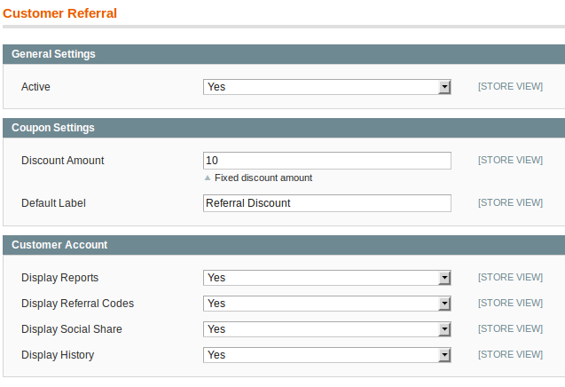

## Configuration

In this article, we’ll look at the Multi-Warehouse extension options. Please follow this sequence of steps:

In administrator panel: System -> Configuration -> Merchant Protocol -> Customer Referral. You’ll eventually see this:

## General Settings

**Active**

Enable and disable the module

## Coupon Settings

**Discount Amount**

Value of fixed discount to give the customer

**Default Label**

Label that will appear in the shopping cart related to discount

## Customer Account

**Display Reports**

Show reports in the area customer, like: Total Earned, Total Available, Total Used and Amount of referral.

**Display Referral Codes**

Show referral link in the area customer

**Display Social Share**

Show reports in the area references

**Display History**

Show referrals history