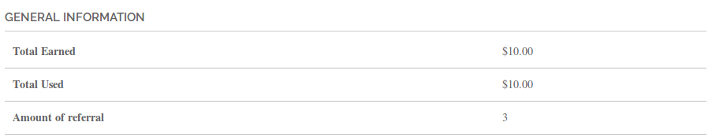
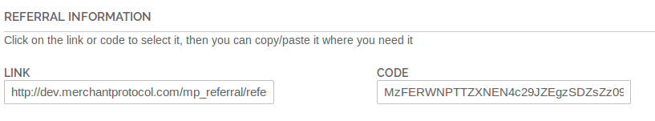
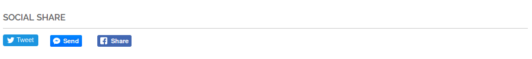
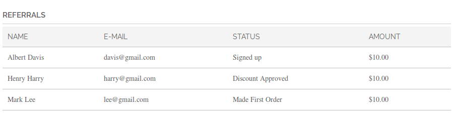
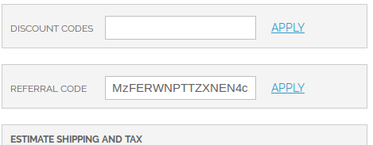
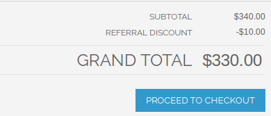
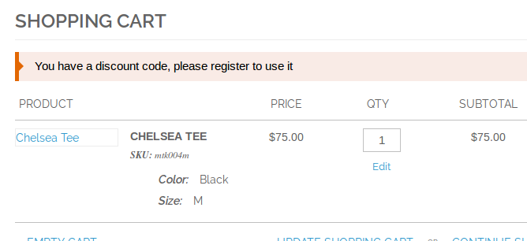

## How to Use?

In customer account panel: Menu -> My Referrals.

## General Information (Reports)

You’ll eventually see this:

**Total Earned**

Sum of all references.

**Total Available**

Sum of all references available to use. Remember, discounts are applied automatically in shopping cart. You can only use one discount per order. 

**Total Used**

Sum of all discount amounts used.

**Amount of referral**

Quantity number of the referral.

## Referral Information

You’ll eventually see this:

**Link**

Referral link to send to friends or share on the web.

**Code**

Referral code to send to friends or share on the web. This code the customer can use in the shopping cart.

## Social Share

You’ll eventually see this:

- Twitter
- Facebook Messenger
- Facebook Share

## Referral (History)

You’ll eventually see this:

List all references linked to your user. Referrals are recorded only after the user create account.

There are 5 status types:

**Signed up**

When user create an account, but no made an order.

**Guest User**

when a user makes a order as a guest or without register.

**Made First Order**

User create an order, but the request has not yet been invoiced.

**Discount Approved**

User paid the order and your discount is available to use.

**Discount Used**

Your discount was used

**Order Canceled**

The order was canceled and you not will be able use the discount.

## Shopping Cart

**Form to insert referral code**

**Discount Applied**

**Alert Message**

