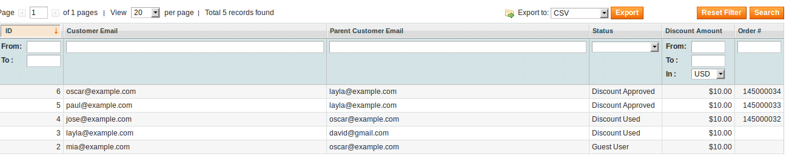
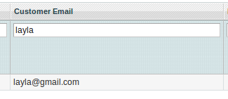
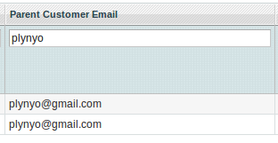
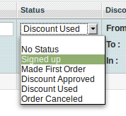
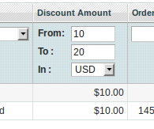
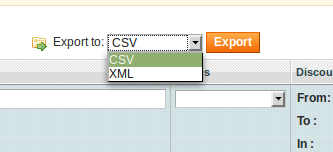

## Administration Report

In customer account panel: Menu -> Customer -> Referrals.
In this area you will can create several reports and exporting to excel or csv files. 

You’ll eventually see this:

## Columns

**Customer Email**

You can filter this field, for example:

**Parent Customer Email**

You can filter this field, for example:

**Status**

You can filter by status, for example:

**Discount Amount**

You can filter by ranges of values and currency, for example:

**Order**

This field is the order number that the user has made using a discount coupon.
You can filter by increment id.

## Export

You can export the grid to excel or csv file. You can export grid filtered too. 

