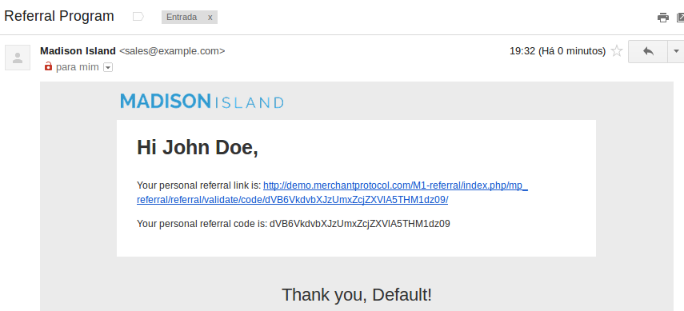

## Newsletter Templates

In administrator panel: Newsletter -> Newsletter Templates

You can insert dynamic url in email templates. 

### How to Use?

Create a new template or edit an existing one and add the following code:
{{var subscriber.getReferralLink()}}

For example:

## Send bulk email to customers

You can send email to all users or specific users

### Create new email template

In administrator panel: System -> Transactional Emails -> Add New Template

You’ll eventually see this:

Choose the template "Referral Program" and click in the button "Load Template".
Now, you can change or save the email template.

### Setting the configurations

In administrator panel: System -> Configuration -> Merchant Protocol -> Customer Referral

You’ll eventually see this:

**Email Template**

Choose the email template
 
**Email Sender**

Choose the email sender

### Sending emails

In administrator panel: Customers -> Manage Customers

Choose the customers or select all clicking in the button "Select All".

You’ll eventually see this:

Now you can click in the button "Submit" to send all emails.

**Success message:**

**Result:**

