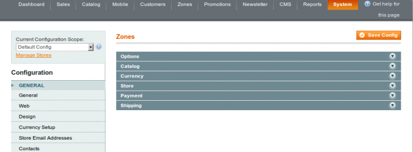
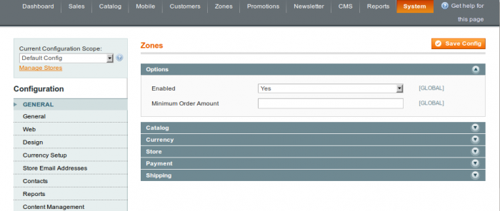
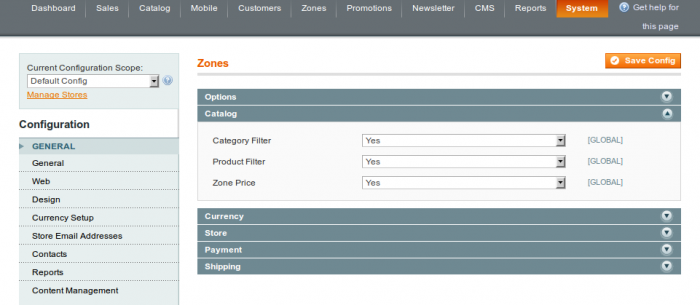
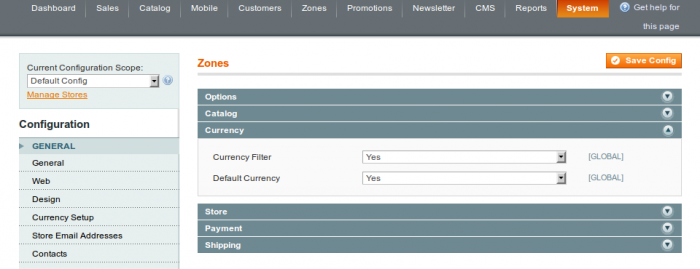
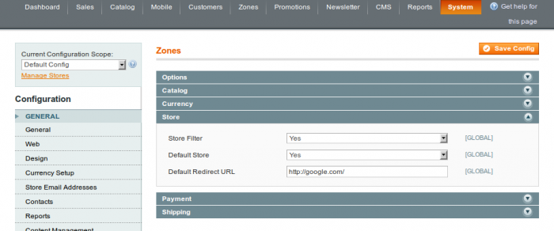
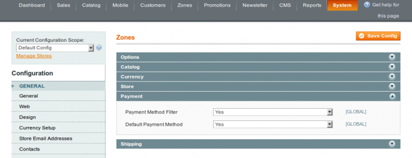
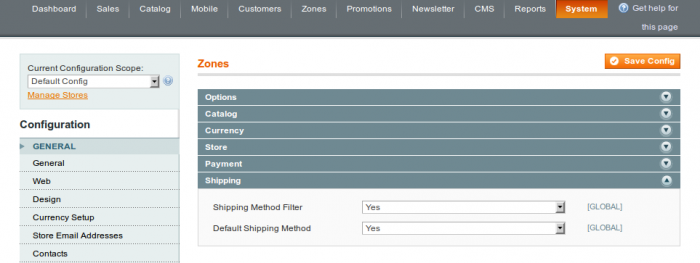

In the admin panel, navigate to: System -> Configuration -> Zones -> Zones

 

The next sections are available in the configuration: Options, Catalog, Currency, Store, Payment, Shipping.

### Options

#### Enabled

Here you can enable / disable module functions globally. This option has a higher priority in the module.

#### Minimum Order Amount

The minimum order amount for all zones.

Note: Minimum order amount should be enabled in the system in order to get this function: System -> Configuration -> Sales -> Sales -> Minimum Order Amount

### Catalog

This section is dedicated for catalog specific options.

#### Category Filter

The product category filter can be enabled / disabled here.

#### Product Filter

Turn the product filter on / off.

#### Zone Price

This option is responsible for zone specific price activation: compound prices, compound special prices, tier prices, catalog price rules compound discount amounts.

### Currency

#### Currency Filter

Enable / disable currency filter here.

#### Default Currency

Allow default currency here.

### Store

#### Store Filter

Enable / disable store filter here.

#### Default Store

Allow default store here.

#### Default Redirect URL

The default redirect URL is forbidden for a visitor.

### Payment

#### Payment Method Filter

Enable / disable payment methods filter.

#### Default Payment Method

Allow default payment method.

### Shipping

#### Shipping Method Filter

Enable / disable shipping methods filter.

#### Default Shipping Method

Allow default shipping method.
