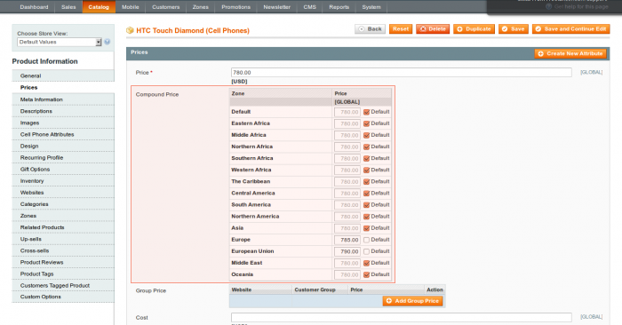
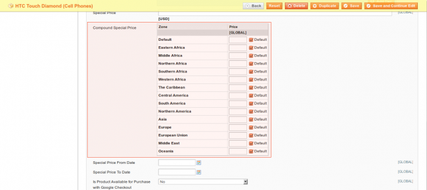
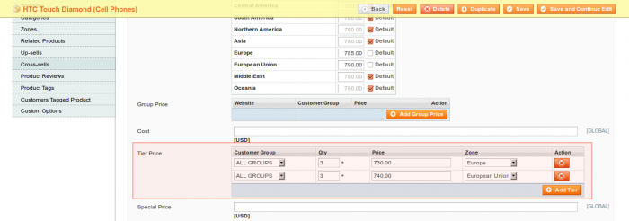
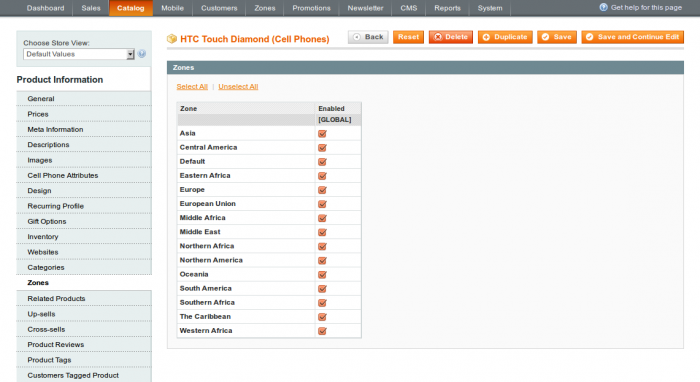

In administrator panel: Catalog -> Manage Products

The Zones Manager extends the default product manager with its own features: available zones, compound price, compound special price, tier price (per zone). Click edit product.

### Compound Price

The Compound Price attribute is placed under Price. It allows you to overwrite the product price for each zone. Once a customer comes to the store and is assigned to a zone, the price gets replaced with the appropriate compound price value. It doesn’t affect further final price calculations.

###. Compound Special Price

The Compound Special Price attribute is similar to Compound Price with the difference that it is tied to the product's special price instead of the product's price. In other words, the corresponding compound special price value replaces the special price depending on the visitor’s place of residence.

### Tier Price

Unlike the default Magento tier price feature, it allows you to set tier price, depending on zone. It is possible to select any single zone or apply the price for all zones by choosing All Zones.

### Zones

The function allows to enable / disable a product for the specific zones.
