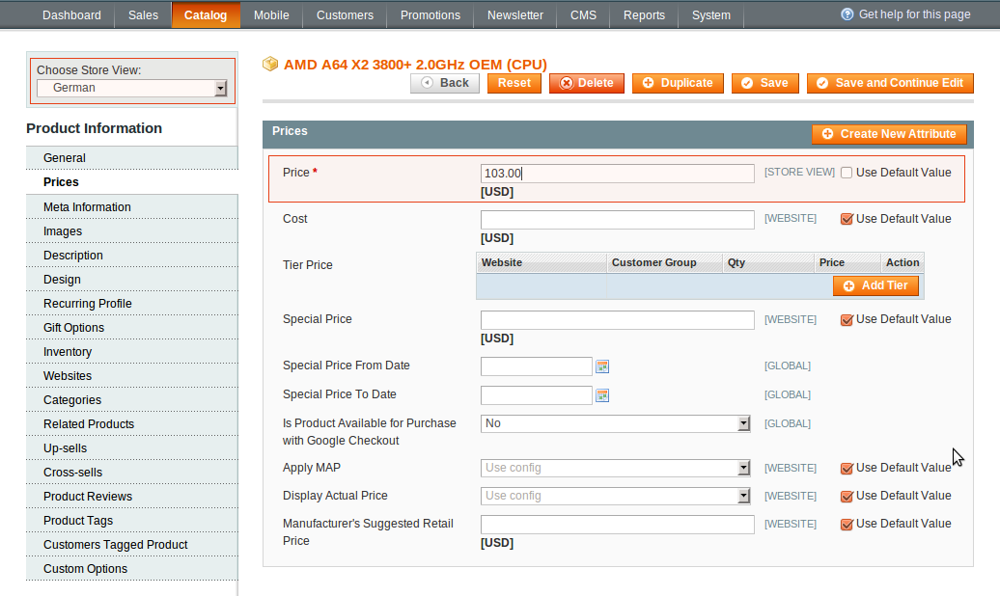

Assume that your website has 3 store views: English, German and French. You wish to have unique prices of the Product A for each distinct store view. For example:

Product | English |	German |	French
----- | ----- | ----- | -----
Product A Price	| $10 | $9 | $8

To do this, go to:

In administrator panel: Catalog -> Manage Products -> Edit Product -> Choose a Store View. You’ll get a notification: Please confirm the site switching. All data that hasn’t been saved will be lost. Confirm it.

 

Remove the check from the box labelled "Use Default" which relates to the Price field. Now enter a price for the product A and press Save or Save and Continue Edit. You can repeat the procedure for any other selected store view, entering a desired product price.
