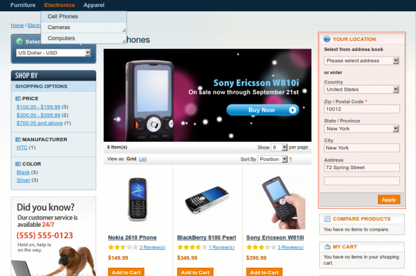

This supplementary tool allows to detect visitor’s location as soon as he / she comes to the website. The location can be either default shipping address or geolocated coordinates or geolocated IP address or the default location or manualy entered by the visitor depending on needs.

### Configuration

In administrator panel: System > Configuration > Customers > Customer Locator

 

You can see Options and Default Location sections there.

### Options

#### Allow to Modify

If the option is enabled then customer will be able to enter / correct his / her location manually on the frontend side.

#### Use Default Shipping Address

If the option is enabled then customer default shipping address will be used as the current location. This option has a highest priority in the address determination process.

#### Use Coordinates Geolocation

If the option is enabled then customer comes geolocated by coordinates through the Google Geocoder service. The client browser provides coordinates if it is allowed by the customer. Coordinates geolocation takes effect if default shipping address isn’t set or disabled.

#### Use IP Geolocation

If the option is enabled then customer comes geolocated by IP through the MaxMind GeoCity database. IP geolocation takes effect if default shipping address isn’t set or disabled and coordinates geolocation is disbaled or failed.

#### Adjust Address on Checkout

This option allows customer location to be updated if the actual checkout address is different.

#### Allowed Attributes

Address attributes list which customer is able to change manually.

#### Required Attributes

Required address attributes to be entered by a customer.

#### Default Address

The default visitor’s location can be defined here. Country, Region / State, Zip / Postal Code, City can be entered. The system sets visitor’s location to default if none of other methods are allowed to determine the customer location.

 
### Manual Selection

This function allows customer to change his / her location manually.

 
### IP Geolocation

In administrator panel: System > Configuration > Customers > IP Geolocation

 

IP Geolocator options are placed here: Use PHP Extension, Database File. This function is based on MaxMind GeoCity database. Use PHP Extension option directs system to use built-in geoip PHP extension in the first turn. If no geoip PHP extensions is installed correctly with GeoCity database or Use PHP Extension option is set to No then function relies on the own database. The correct GeoCity database path must be entered in Database File option if no geoip PHP extension is installed properly with GeoCity database.

This supplementary tool allows to detect visitor’s location as soon as he / she comes to the website. The location can be either default shipping address or geolocated IP address or the default location or manualy entered by the visitor depending on needs.

In administrator panel: System > Configuration > Customers > Customer Locator

 

You can see Options and Default Location sections there.

**Options**

 - Allow to Modify – If option is enabled then customer will be able to enter / correct his / her location on the frontend side.
 - Select Default Shipping Address – If option is enabled then customer default shipping address will be used as the current location instead of geolocated IP address geolocated (if default shipping address is present).
 - Allowed Attributes – Address attributes list to display in Your Location box.
 - Required Attributes – Required address attributes.

**Default Address**

The default visitor’s location can be defined here. Country, Region / State, Zip / Postal Code, City can be entered. The system sets visitor’s location to default if IP address geolocation failed (it is possible for small percentage of visitors).

On the frontend:

 