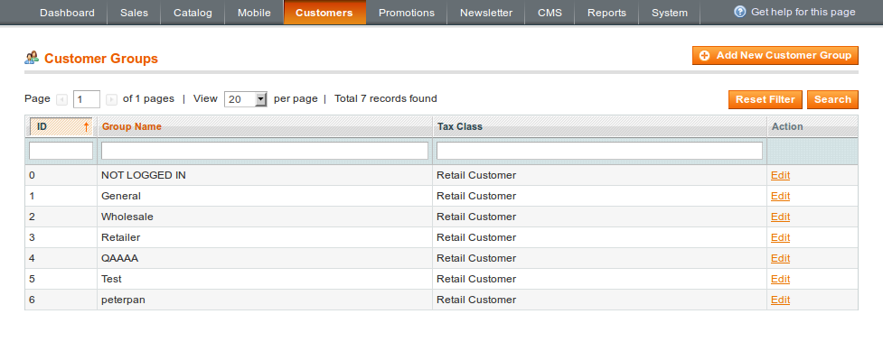
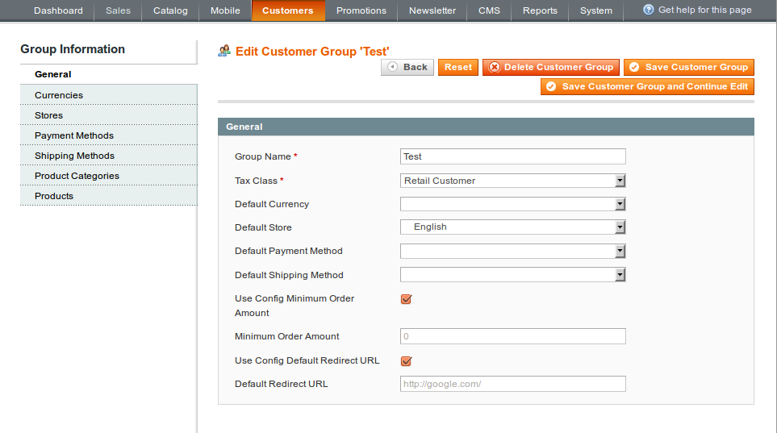
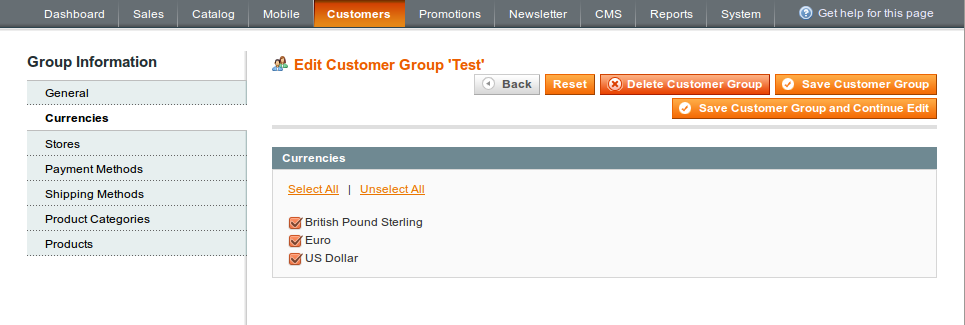
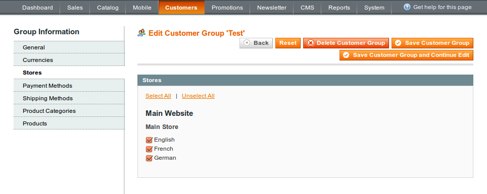
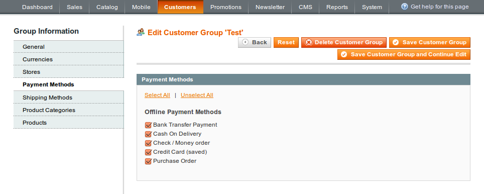
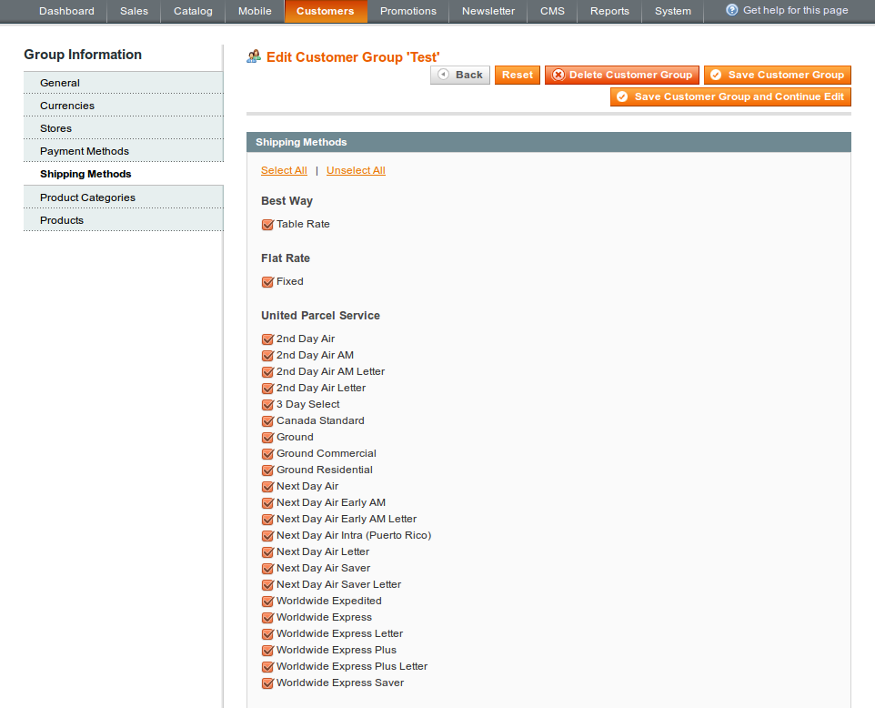
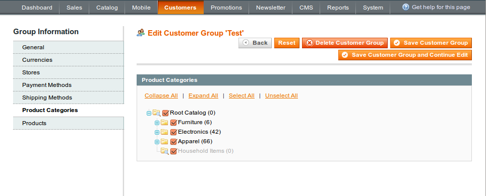
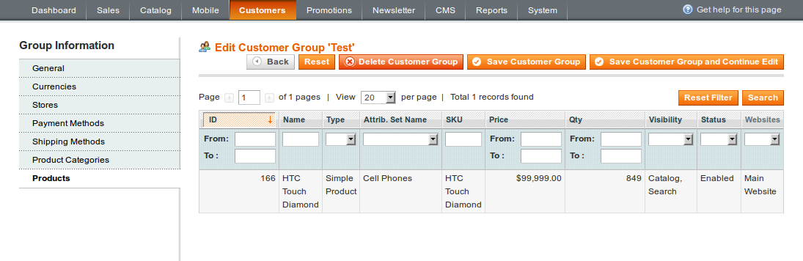

In administrator panel: Customers -> Customer Groups

Here you can create new customer groups by pressing the Add New Customer Group button or edit existing ones by clicking the Edit link.

 
## General

 

The only tab that is available for the create new customer group process is General. Here you fill in customer group general details

### Group Name

Customer group display name.

### Tax Class

Customer group tax class.

### Default Currency

The currency that is coming selected automatically for a customer assigned to the customer group. Default Currency must be selected in Currencies.

### Default Store

The store which a customer is being redirected to initially. The value must be selected in Stores.

### Default Payment Method

The payment method that is selected by default for the checkout process. The value must be selected in Payment Methods.

### Default Shipping Method

The shipping method that is selected by default for the checkout and estimate shipping functions. The value must be selected in Shipping Methods.

### Minimum Order Amount

The minimum order amount for the customer group. Tick Use Config Minimum Order Amount checkbox if the value should be similar to that is set in the configuration globally or enter the custom one.

### Default Redirect URL

The default redirection URL in case if a store isn’t allowed for a customer. Check Use Config Default Redirect URL to inherit the value that is set in the configuration globally.

## Currencies

 

Allowed currencies list for the customer group. The store base currency is available independently of this attribute. The currency must be enabled in the configuration initially: System -> General -> Currency Setup -> Currency Options -> Allowed Currencies.

## Stores

 

Allowed stores list for the customer group.

## Payment Methods

 

Allowed payment methods list for the customer group. The payment method must be previously enabled in the Payment Methods configuration settings section: System -> Configuration -> Sales -> Payment Methods.

## Shipping Methods

 

Allowed shipping methods list for the customer group. The shipping carrier must be previously enabled in the Shipping Methods configuration settings section: System -> Configuration -> Sales -> Shipping Methods.

## Product Categories

 

Administrator is able to overwrite available product categories list depending on customer group here.

Note, product category availability doesn’t affect products availability itself.

## Products

 

The list of products enabled for the customer group. The customer group can be enabled for the specific product in products manager.