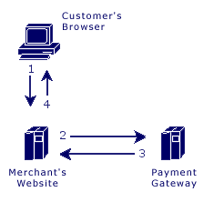

#### Transactions

##### Steps:

1. The customer sends their payment information to the merchant's web site.
2. The merchant web site posts the payment data to the Payment Gateway.
3. The Payment Gateway responds immediately with the results of the transactions.
4. The merchant web site displays the appropriate message to the customer.

The communication method used to send messages to the Payment Gateway's server is the standard HTTP protocol over an SSL connection.

In the Direct Post method, the communications with the cardholder (Steps 1 and 4) are developed completely by the merchant and therefore are not defined by the Payment Gateway. Step 1 should simply collect the payment data from the cardholder and Step 4 should display the appropriate transaction receipt or declined message.

In Step 2, transaction details should be delivered to the Payment Gateway using the POST method with the appropriate variables defined below posted along with the request.

In Step 3, the transaction responses are returned in the body of the HTTP response in a query string name/value format delimited by ampersands. For example: variable1=value1&variable2=value2&variable3=value3

### Customer Vault

The Customer Vault was designed specifically for businesses of any size to address concerns about handling customer payment information. Visa and MasterCard have instituted the Payment Card Industry (PCI) Data Security to protect cardholder data, wherever it resides, ensuring that members, merchants, and service providers maintain the highest information security standards.

These associations have also deemed that merchants will be held liable for any breach of cardholder data. This has become a major concern for merchants who handle credit card or electronic check payments. The Customer Vault is designed for these merchants who desire to avoid the tremendous costs and resources involved in becoming PCI compliant under these circumstances.

The Customer Vault does this by allowing merchants to transmit their payment information through a Secure Sockets Layer (SSL) connection for storage in our Level 1 PCI certified data facility. Once the customer record has been securely transmitted to the Customer Vault, the merchant can then initiate transactions remotely without having to access cardholder information directly. This process is accomplished without the merchant storing the customer's payment information in their local database or payment application.
