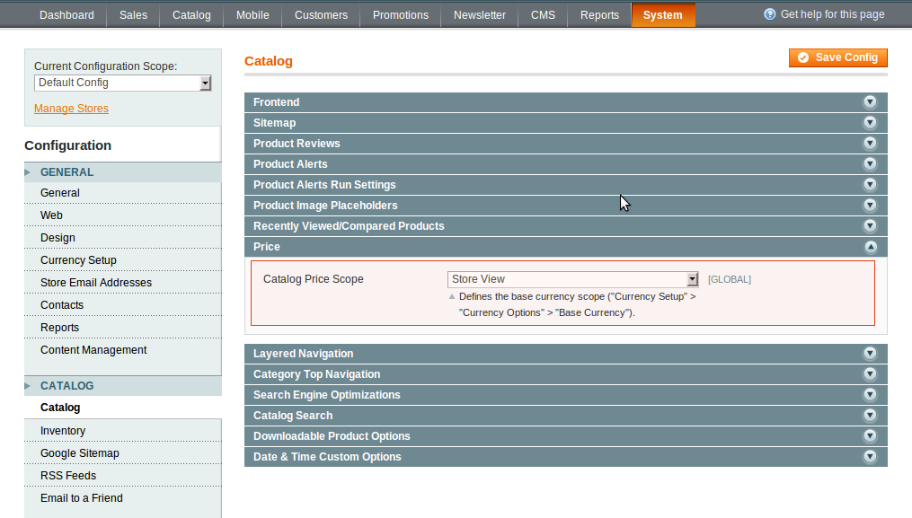

To enable Store View Pricing, follow these steps:

In administrator panel: System -> Configuration -> Catalog -> Catalog -> Price -> Catalog Price Scope -> Store View. Press Save Config button, regenerate Product Prices index.

 

Opt Global or Website if you want to disable Store View Pricing.

In administrator panel: System -> Configuration -> Catalog -> Catalog -> Price -> Catalog Price Scope -> Global / Website. Press Save Config button.